# API Flow Diagrams

## Flight Claim System - Request/Response Flow Documentation

This document provides detailed visual representations of how HTTP requests flow through the Flight Claim System, from initial request to final response, including all CRUD operations, validation steps, and error handling paths.

## Overview: General Request Flow

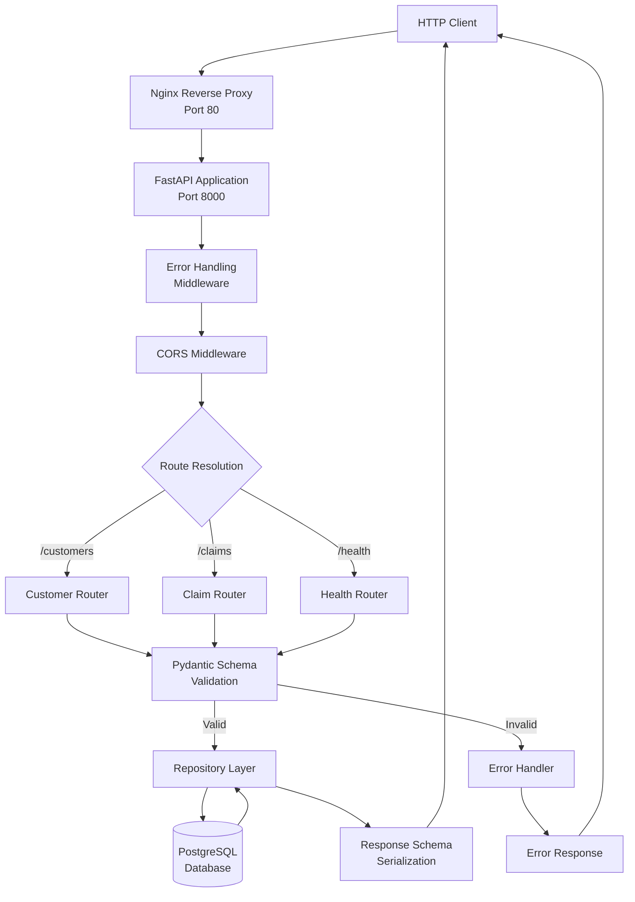

## Customer Operations Flow

### POST /customers - Create Customer

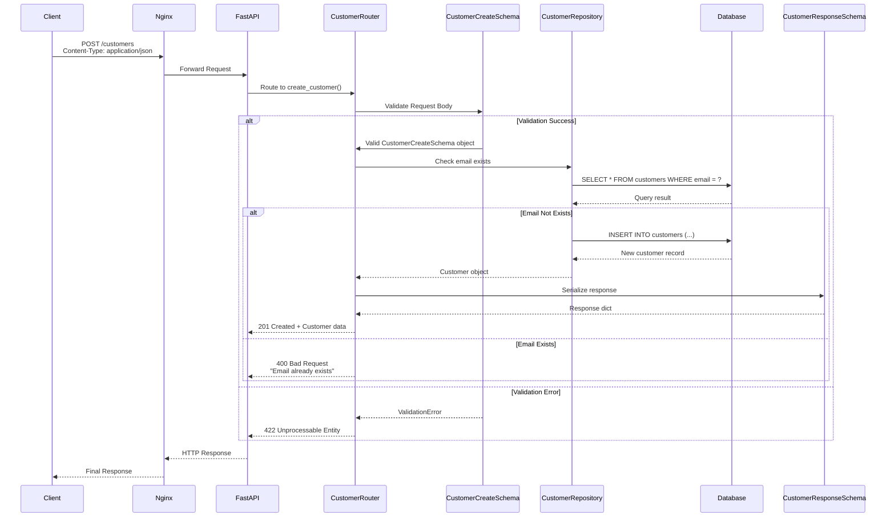

### GET /customers/{customer_id} - Get Customer

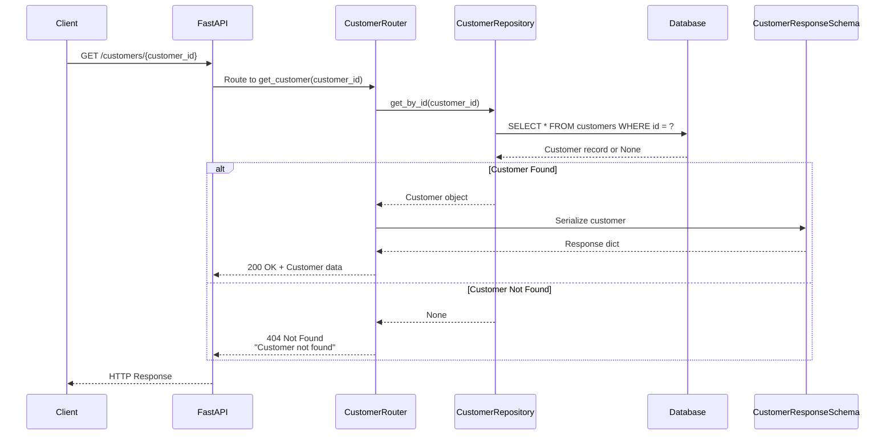

### PUT /customers/{customer_id} - Update Customer (Complete)

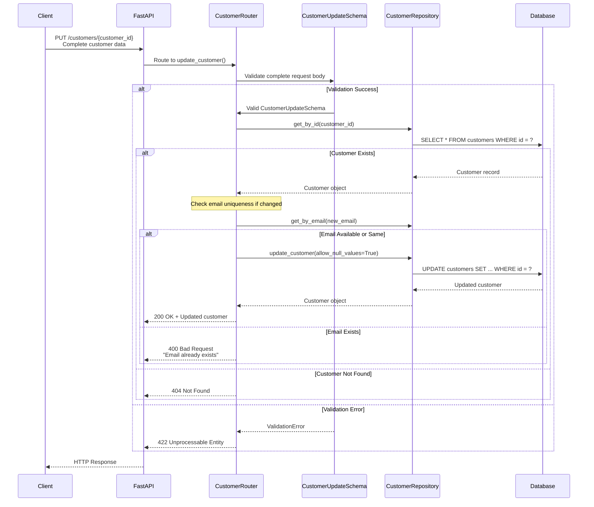

### PATCH /customers/{customer_id} - Partial Update

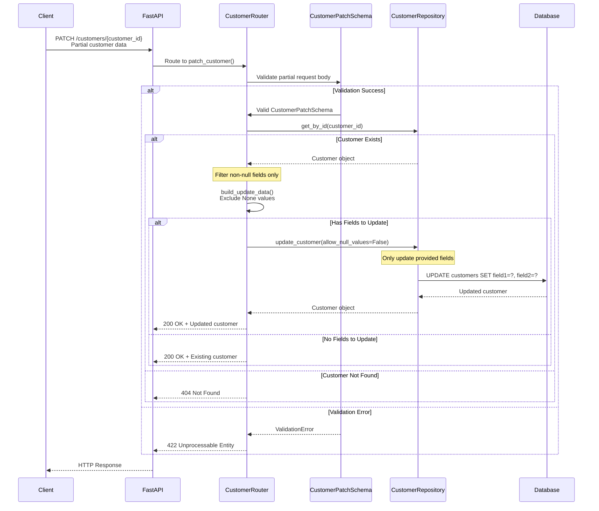

## Claim Operations Flow

### POST /claims - Create Claim

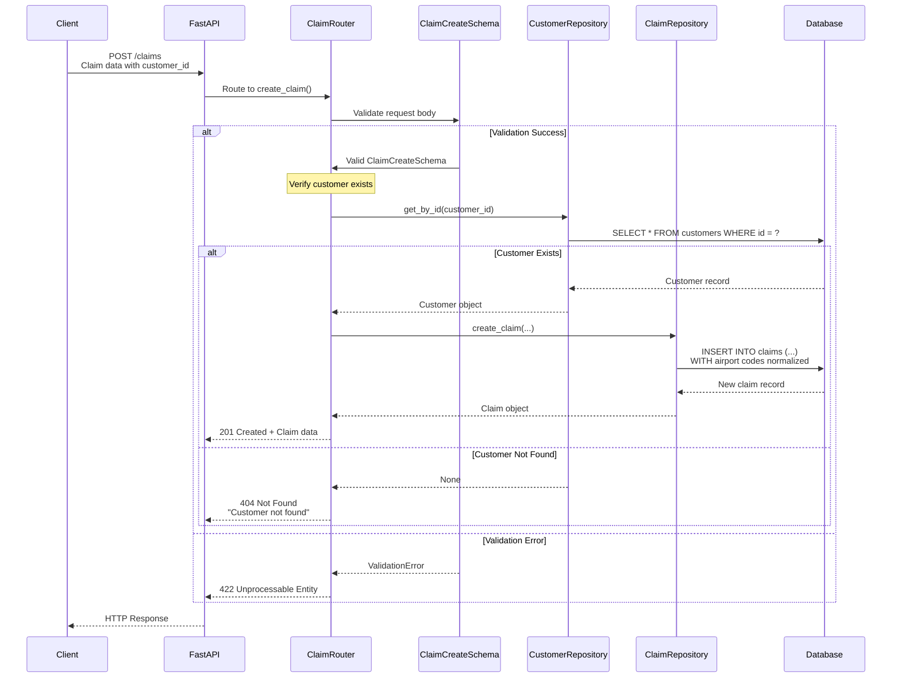

### POST /claims/submit - Submit Claim with Customer Info

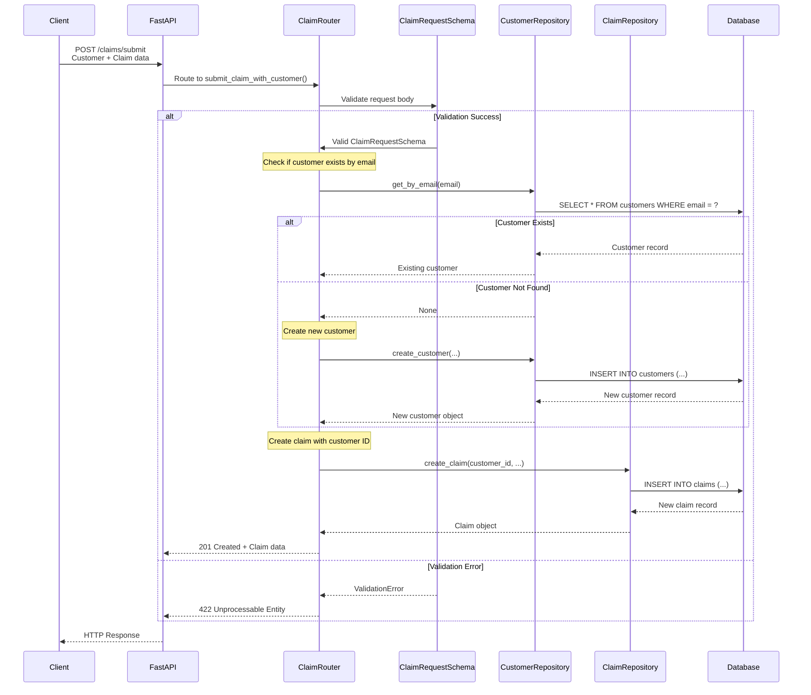

## PUT vs PATCH Implementation Flow

### Key Differences in Repository Layer

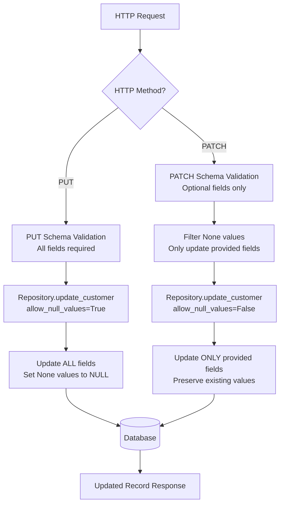

### Repository Update Logic

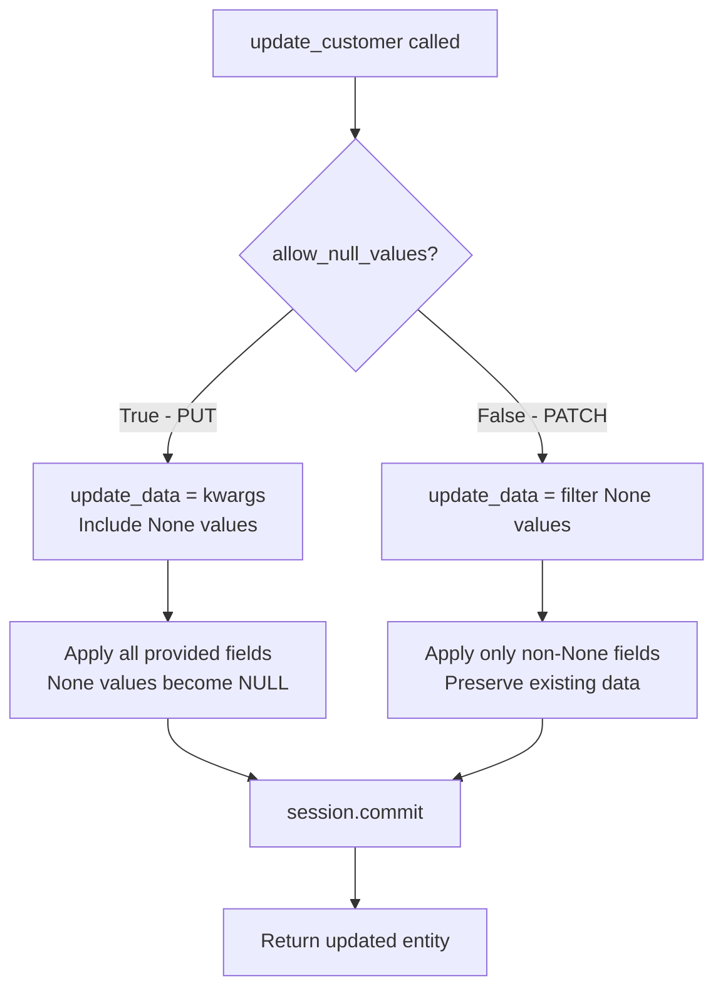

## Error Handling Flow

### Comprehensive Error Processing

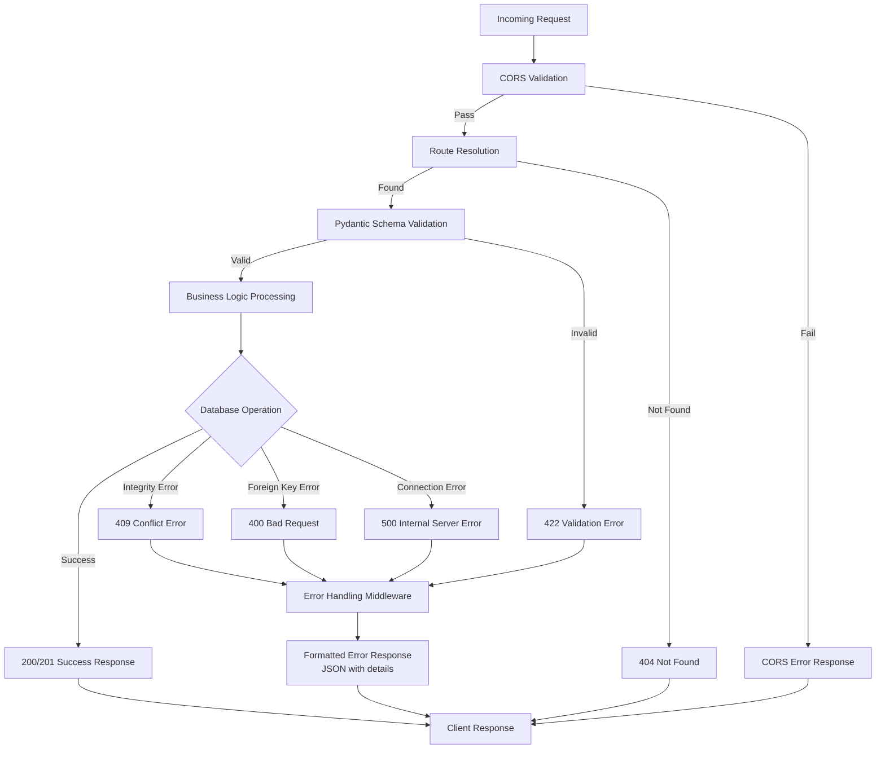

### Error Response Format

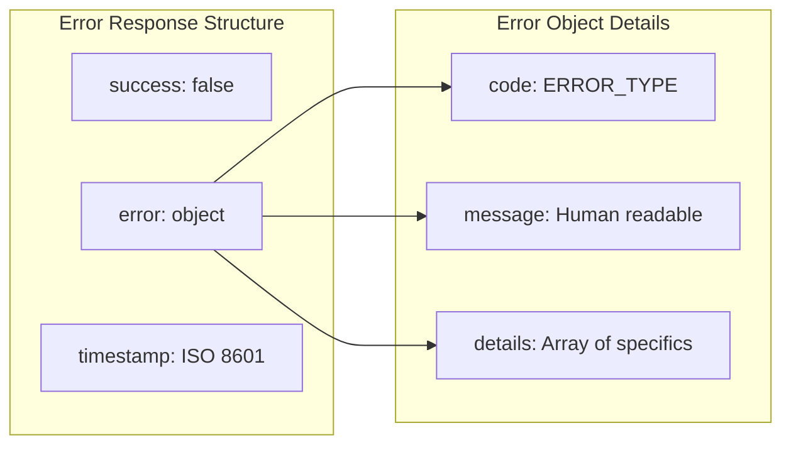

## Health Check Flow

### Simple Health Check

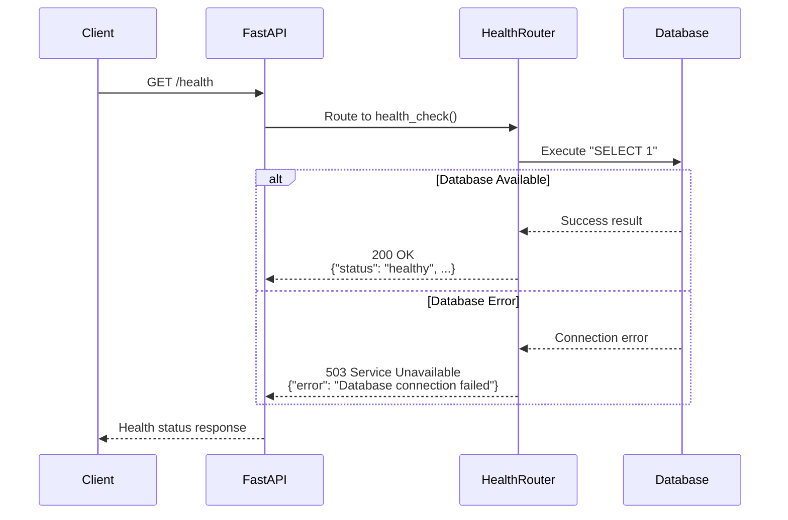

## Search Operations Flow

### Customer Search by Email

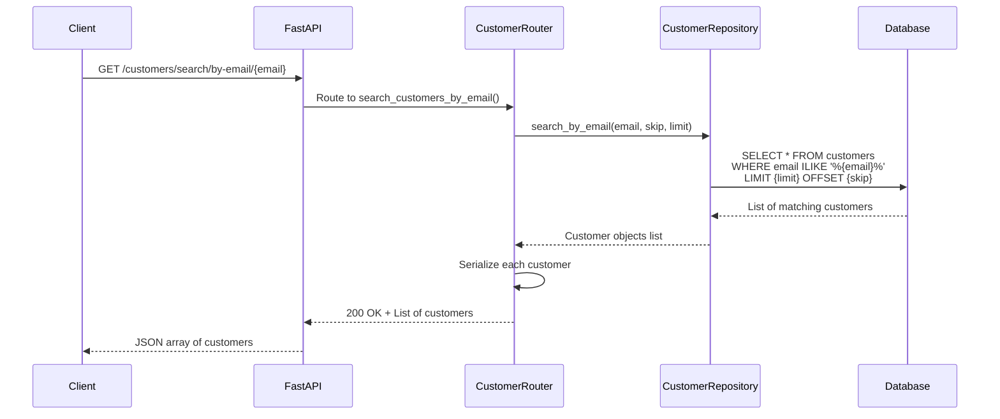

## Pagination Flow

### List Operations with Pagination

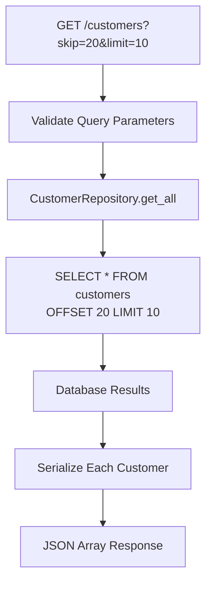

## Transaction Management

### Database Transaction Flow

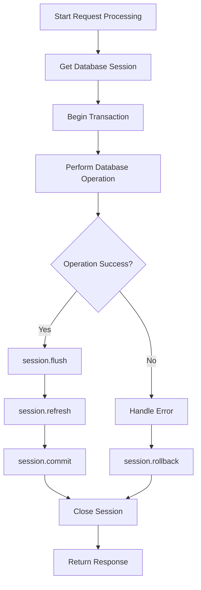

This comprehensive flow documentation shows exactly how requests are processed through each layer of the Flight Claim System, from HTTP entry to database operations and back to the client response.