# Data Flow Visualization

## Flight Claim System - Complete Request Journey

This document provides detailed visual representations of how data flows through the Flight Claim System, from the initial HTTP request through all system layers to the PostgreSQL database and back to the client.

## Overview: Complete System Data Flow

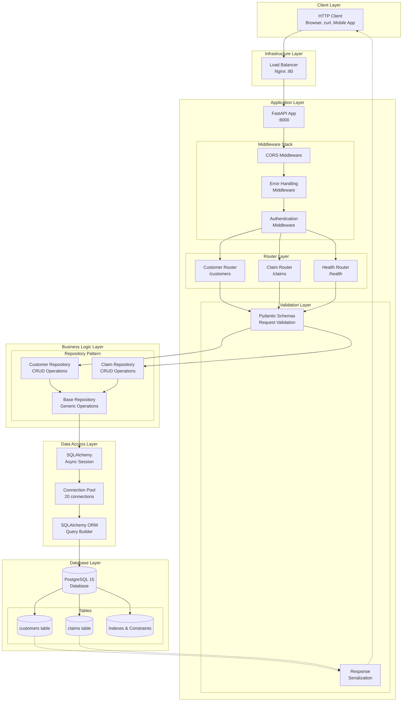

## Detailed Request Flow Analysis

### 1. HTTP Request Entry Point

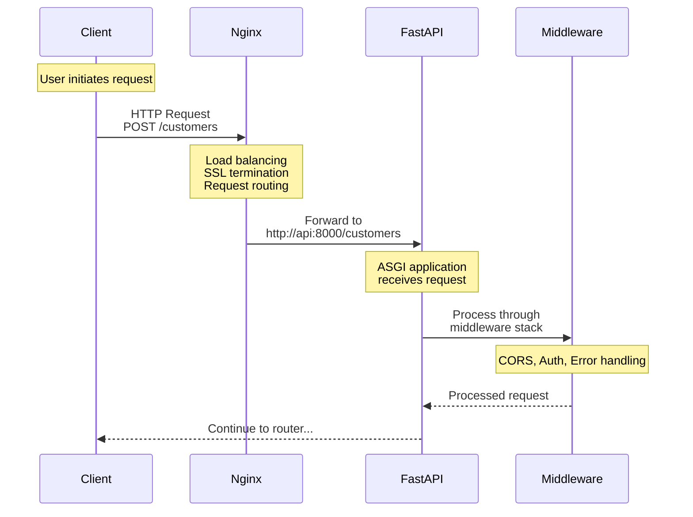

### 2. Middleware Processing Pipeline

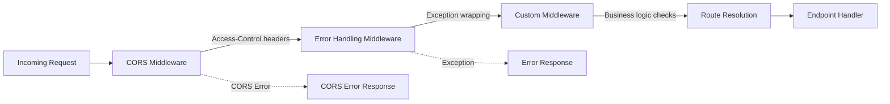

### 3. Router and Validation Flow

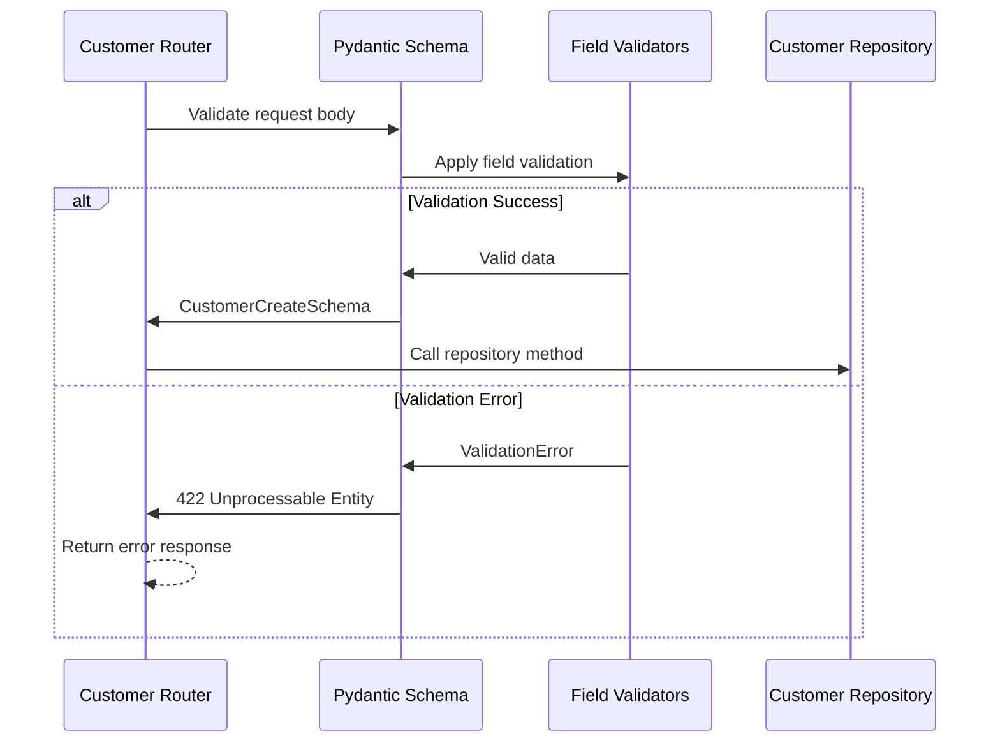

### 4. Repository Pattern Data Flow

```mermaid
graph TB
    subgraph "Repository Layer Architecture"
        ENDPOINT[API Endpoint] --> REPO_INTERFACE[Repository Interface]
        
        REPO_INTERFACE --> CUSTOMER_REPO[CustomerRepository]
        REPO_INTERFACE --> CLAIM_REPO[ClaimRepository]
        
        CUSTOMER_REPO --> BASE_REPO[BaseRepository]
        CLAIM_REPO --> BASE_REPO
        
        BASE_REPO --> SESSION_INJECT[Session Injection]
        SESSION_INJECT --> CRUD_OPERATIONS[CRUD Operations]
        
        CRUD_OPERATIONS --> CREATE[create()]
        CRUD_OPERATIONS --> READ[get_by_id()]
        CRUD_OPERATIONS --> UPDATE[update()]
        CRUD_OPERATIONS --> DELETE[delete()]
        
        CREATE --> DB_OPERATION[Database Operation]
        READ --> DB_OPERATION
        UPDATE --> DB_OPERATION
        DELETE --> DB_OPERATION
    end
```

### 5. Database Transaction Flow

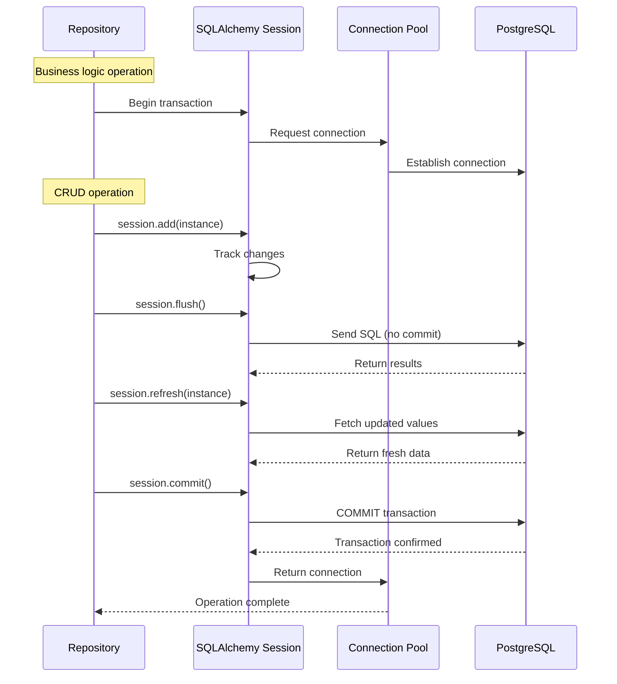

## CRUD Operation Data Flows

### Create Customer Flow

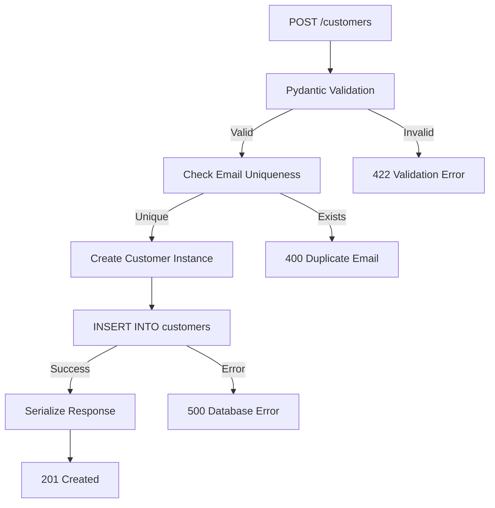

### Update Customer Flow (PUT vs PATCH)

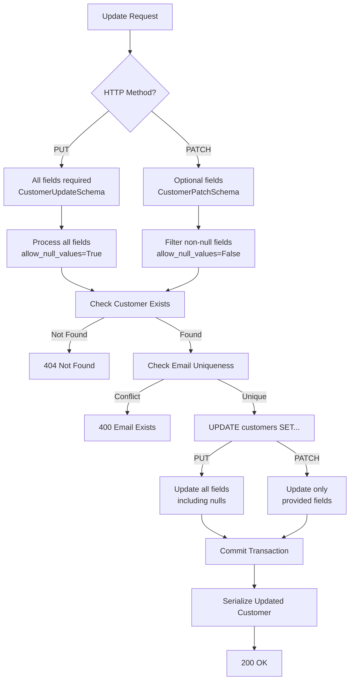

### Complex Claim Creation Flow

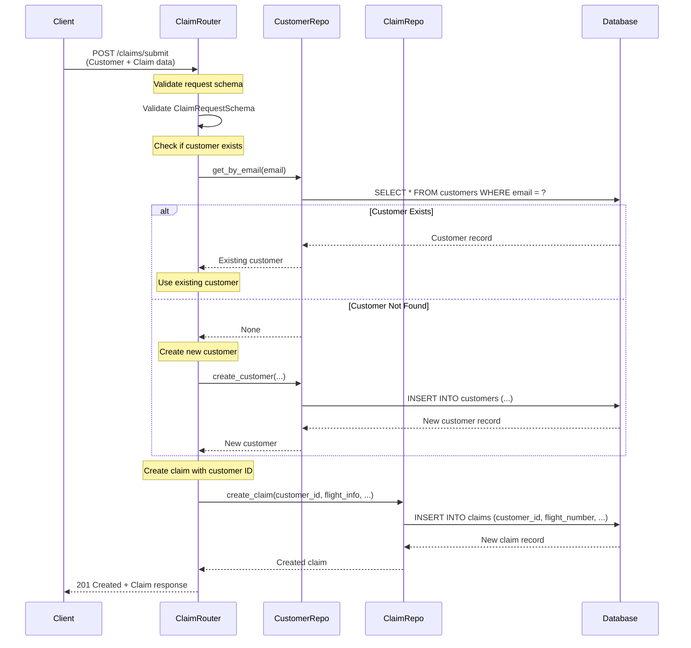

## Data Transformation Pipeline

### Request Data Transformation

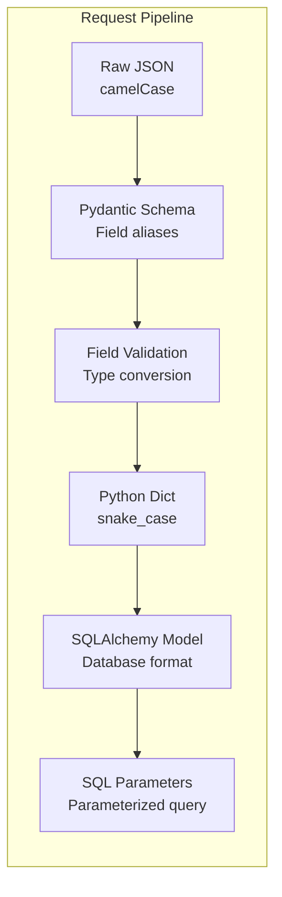

### Response Data Transformation

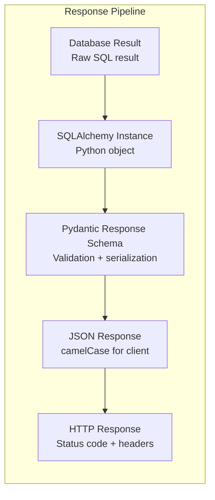

### Field Mapping Examples

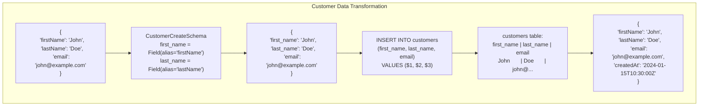

## Error Flow Visualization

### Exception Propagation Flow

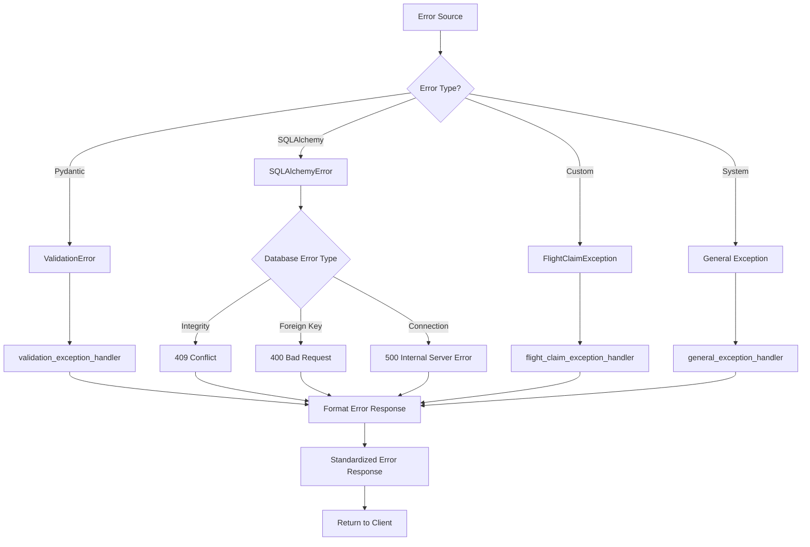

### Error Response Structure Flow

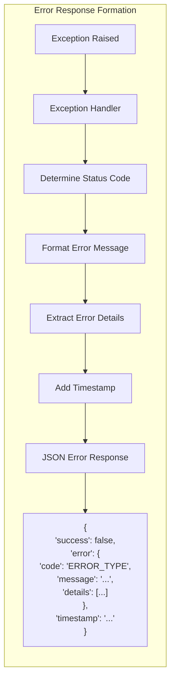

## Performance Data Flow Analysis

### Connection Pool Flow

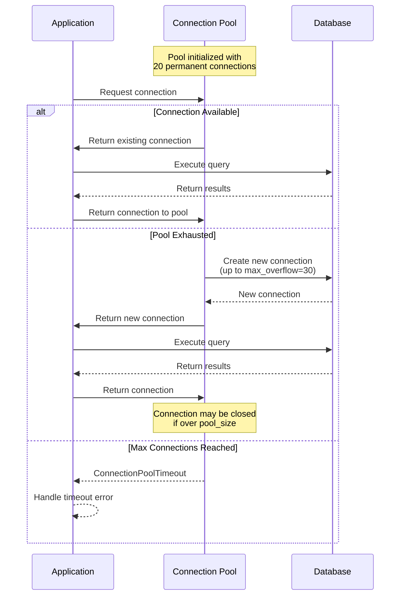

### Query Optimization Flow

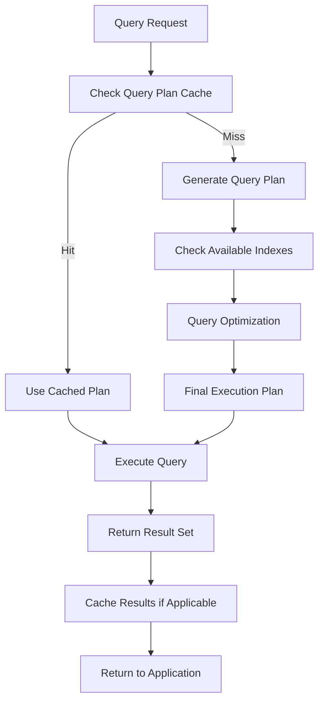

## Monitoring and Observability Flow

### Request Tracing Flow

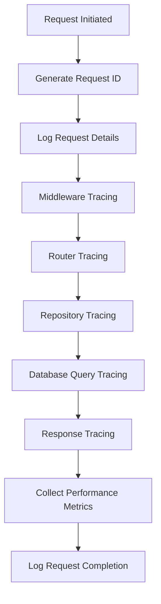

### Health Check Data Flow

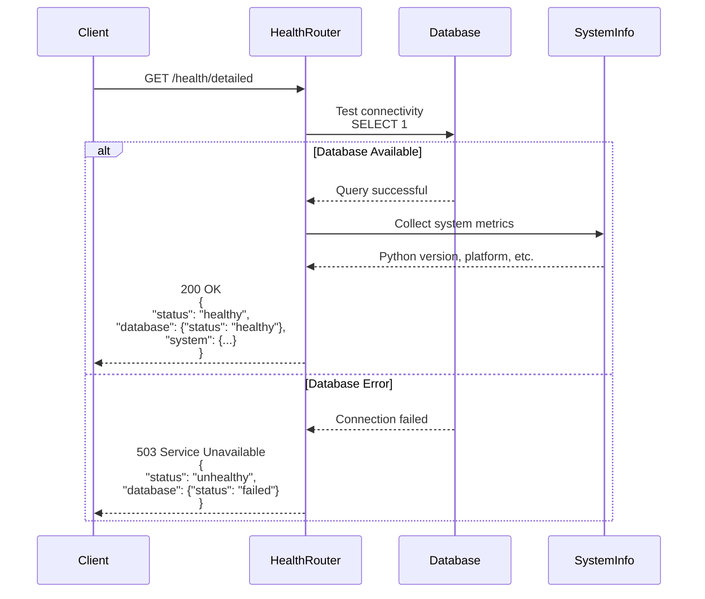

This comprehensive data flow visualization demonstrates how requests traverse every layer of the Flight Claim System, providing complete transparency into the system's operation from HTTP entry to database persistence and back.