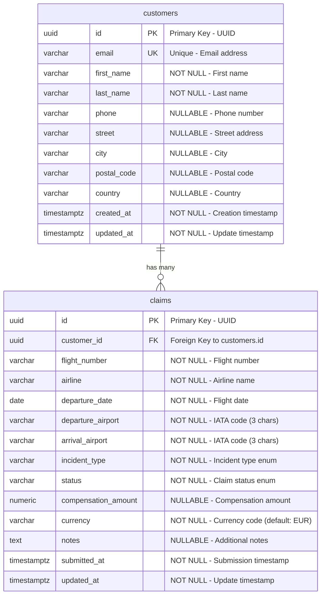
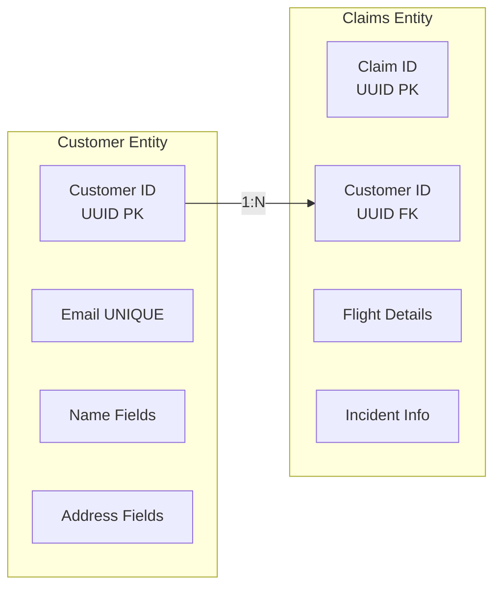

# Database Schema Documentation

## Flight Claim System - Database Design

This document provides comprehensive documentation of the PostgreSQL database schema for the Flight Claim System, including entity relationships, constraints, indexes, and data validation rules.

## Schema Overview

The database follows a normalized relational design with two primary entities: **Customers** and **Claims**, maintaining referential integrity through foreign key relationships.



## Table Specifications

### Customers Table

The `customers` table stores user profile information and serves as the primary entity for claim ownership.

#### Column Definitions

| Column | Type | Constraints | Description |
|--------|------|-------------|-------------|
| `id` | `UUID` | `PRIMARY KEY`, `DEFAULT uuid_generate_v4()` | Unique customer identifier |
| `email` | `VARCHAR(255)` | `UNIQUE`, `NOT NULL`, `INDEX` | Customer email address |
| `first_name` | `VARCHAR(50)` | `NOT NULL` | Customer's first name |
| `last_name` | `VARCHAR(50)` | `NOT NULL` | Customer's last name |
| `phone` | `VARCHAR(20)` | `NULLABLE` | Contact phone number |
| `street` | `VARCHAR(255)` | `NULLABLE` | Street address |
| `city` | `VARCHAR(100)` | `NULLABLE` | City name |
| `postal_code` | `VARCHAR(20)` | `NULLABLE` | Postal/ZIP code |
| `country` | `VARCHAR(100)` | `NULLABLE` | Country name |
| `created_at` | `TIMESTAMPTZ` | `NOT NULL`, `DEFAULT NOW()` | Record creation timestamp |
| `updated_at` | `TIMESTAMPTZ` | `NOT NULL`, `DEFAULT NOW()`, `ON UPDATE NOW()` | Last modification timestamp |

#### Indexes and Constraints

```sql
-- Primary key constraint
CONSTRAINT pk_customers PRIMARY KEY (id)

-- Unique constraint on email
CONSTRAINT uq_customers_email UNIQUE (email)

-- Index on email for search performance
CREATE INDEX ix_customers_email ON customers (email);

-- Automatic timestamp update trigger
CREATE TRIGGER trg_customers_updated
    BEFORE UPDATE ON customers
    FOR EACH ROW EXECUTE FUNCTION set_updated_at();
```

#### Business Rules and Validation

- **Email Validation**: Must be a valid email format with '@' and domain
- **Name Requirements**: First and last names are mandatory (max 50 chars each)
- **Phone Format**: Optional, up to 20 characters for international numbers
- **Address Fields**: All address components are optional for flexibility
- **Audit Trail**: Automatic timestamps for creation and updates

### Claims Table

The `claims` table stores flight compensation claim information with detailed flight and incident data.

#### Column Definitions

| Column | Type | Constraints | Description |
|--------|------|-------------|-------------|
| `id` | `UUID` | `PRIMARY KEY`, `DEFAULT uuid_generate_v4()` | Unique claim identifier |
| `customer_id` | `UUID` | `FOREIGN KEY`, `NOT NULL` | Reference to customers.id |
| `flight_number` | `VARCHAR(10)` | `NOT NULL` | Flight number (e.g., "LH1234") |
| `airline` | `VARCHAR(100)` | `NOT NULL` | Airline company name |
| `departure_date` | `DATE` | `NOT NULL` | Scheduled departure date |
| `departure_airport` | `VARCHAR(3)` | `NOT NULL` | IATA departure airport code |
| `arrival_airport` | `VARCHAR(3)` | `NOT NULL` | IATA arrival airport code |
| `incident_type` | `VARCHAR(50)` | `NOT NULL`, `CHECK` | Type of flight incident |
| `status` | `VARCHAR(50)` | `NOT NULL`, `CHECK`, `DEFAULT 'submitted'` | Current claim status |
| `compensation_amount` | `NUMERIC(10,2)` | `NULLABLE` | Compensation amount |
| `currency` | `VARCHAR(3)` | `NOT NULL`, `DEFAULT 'EUR'` | Currency code |
| `notes` | `TEXT` | `NULLABLE` | Additional claim notes |
| `submitted_at` | `TIMESTAMPTZ` | `NOT NULL`, `DEFAULT NOW()` | Claim submission time |
| `updated_at` | `TIMESTAMPTZ` | `NOT NULL`, `DEFAULT NOW()`, `ON UPDATE NOW()` | Last modification time |

#### Enumerated Values

**Incident Types** (stored as `incident_type`):
- `delay` - Flight delayed beyond threshold
- `cancellation` - Flight cancelled
- `denied_boarding` - Passenger denied boarding (overbooking)
- `baggage_delay` - Baggage delivery delay

**Claim Status** (stored as `status`):
- `draft` - Claim being prepared
- `submitted` - Claim submitted for review
- `under_review` - Being processed
- `approved` - Claim approved for payment
- `rejected` - Claim denied
- `paid` - Compensation paid
- `closed` - Claim process completed

#### Constraints and Indexes

```sql
-- Primary key constraint
CONSTRAINT pk_claims PRIMARY KEY (id)

-- Foreign key constraint
CONSTRAINT fk_claims_customer_id_customers 
    FOREIGN KEY (customer_id) REFERENCES customers (id)

-- Check constraint for incident types
CONSTRAINT ck_claims_incident_type 
    CHECK (incident_type IN ('delay', 'cancellation', 'denied_boarding', 'baggage_delay'))

-- Check constraint for claim status
CONSTRAINT ck_claims_status 
    CHECK (status IN ('draft', 'submitted', 'under_review', 'approved', 'rejected', 'paid', 'closed'))

-- Indexes for common queries
CREATE INDEX ix_claims_customer_id ON claims (customer_id);
CREATE INDEX ix_claims_status ON claims (status);
CREATE INDEX ix_claims_departure_date ON claims (departure_date);
CREATE INDEX ix_claims_flight_number ON claims (flight_number);

-- Automatic timestamp update trigger
CREATE TRIGGER trg_claims_updated
    BEFORE UPDATE ON claims
    FOR EACH ROW EXECUTE FUNCTION set_updated_at();
```

## Database Relationships

### One-to-Many: Customer → Claims



### Relationship Characteristics

- **Cardinality**: One customer can have many claims (1:N)
- **Referential Integrity**: Claims must reference existing customers
- **Cascade Behavior**: Deleting a customer cascades to delete their claims
- **Index Performance**: Foreign key indexed for efficient joins

### SQLAlchemy ORM Relationships

```python
# In Customer model
claims = relationship(
    "Claim", 
    back_populates="customer", 
    cascade="all, delete-orphan"
)

# In Claim model
customer = relationship(
    "Customer", 
    back_populates="claims"
)
```

## Data Validation Rules

### Application-Level Validation (Pydantic)

#### Customer Validation
```python
class CustomerCreateSchema(BaseModel):
    email: EmailStr  # Automatic email format validation
    first_name: str = Field(..., max_length=50)
    last_name: str = Field(..., max_length=50)
    phone: Optional[str] = Field(None, max_length=20)
    address: Optional[AddressSchema] = None
```

#### Claim Validation
```python
class ClaimCreateSchema(BaseModel):
    flight_number: str = Field(..., min_length=3, max_length=10)
    departure_airport: str = Field(..., min_length=3, max_length=3)
    arrival_airport: str = Field(..., min_length=3, max_length=3)
    incident_type: str  # Validated against enum values
```

### Database-Level Validation (SQLAlchemy)

#### Model Validators
```python
class Customer(Base):
    @validates('email')
    def validate_email(self, key, address):
        if '@' not in address or '.' not in address.split('@')[-1]:
            raise ValueError("Invalid email format")
        return address

class Claim(Base):
    @validates('departure_airport', 'arrival_airport')
    def validate_airport_code(self, key, code):
        if len(code) != 3:
            raise ValueError("Airport code must be 3 characters")
        return code.upper()
```

## Database Schema SQL

### Complete Schema Definition

```sql
-- Enable UUID extension
CREATE EXTENSION IF NOT EXISTS "uuid-ossp";

-- Customer table
CREATE TABLE customers (
    id UUID PRIMARY KEY DEFAULT uuid_generate_v4(),
    email VARCHAR(255) NOT NULL UNIQUE,
    first_name VARCHAR(50) NOT NULL,
    last_name VARCHAR(50) NOT NULL,
    phone VARCHAR(20),
    street VARCHAR(255),
    city VARCHAR(100),
    postal_code VARCHAR(20),
    country VARCHAR(100),
    created_at TIMESTAMPTZ NOT NULL DEFAULT NOW(),
    updated_at TIMESTAMPTZ NOT NULL DEFAULT NOW()
);

-- Claims table
CREATE TABLE claims (
    id UUID PRIMARY KEY DEFAULT uuid_generate_v4(),
    customer_id UUID NOT NULL REFERENCES customers(id) ON DELETE CASCADE,
    flight_number VARCHAR(10) NOT NULL,
    airline VARCHAR(100) NOT NULL,
    departure_date DATE NOT NULL,
    departure_airport VARCHAR(3) NOT NULL,
    arrival_airport VARCHAR(3) NOT NULL,
    incident_type VARCHAR(50) NOT NULL CHECK (
        incident_type IN ('delay', 'cancellation', 'denied_boarding', 'baggage_delay')
    ),
    status VARCHAR(50) NOT NULL DEFAULT 'submitted' CHECK (
        status IN ('draft', 'submitted', 'under_review', 'approved', 'rejected', 'paid', 'closed')
    ),
    compensation_amount NUMERIC(10,2),
    currency VARCHAR(3) NOT NULL DEFAULT 'EUR',
    notes TEXT,
    submitted_at TIMESTAMPTZ NOT NULL DEFAULT NOW(),
    updated_at TIMESTAMPTZ NOT NULL DEFAULT NOW()
);

-- Indexes for performance
CREATE INDEX ix_customers_email ON customers (email);
CREATE INDEX ix_claims_customer_id ON claims (customer_id);
CREATE INDEX ix_claims_status ON claims (status);
CREATE INDEX ix_claims_departure_date ON claims (departure_date);
CREATE INDEX ix_claims_flight_number ON claims (flight_number);

-- Timestamp update function
CREATE OR REPLACE FUNCTION set_updated_at()
RETURNS TRIGGER AS $$
BEGIN
    NEW.updated_at = NOW();
    RETURN NEW;
END;
$$ LANGUAGE plpgsql;

-- Triggers for automatic timestamp updates
CREATE TRIGGER trg_customers_updated
    BEFORE UPDATE ON customers
    FOR EACH ROW EXECUTE FUNCTION set_updated_at();

CREATE TRIGGER trg_claims_updated
    BEFORE UPDATE ON claims
    FOR EACH ROW EXECUTE FUNCTION set_updated_at();
```

## Query Patterns and Performance

### Common Query Patterns

#### Customer Queries
```sql
-- Find customer by email
SELECT * FROM customers WHERE email = 'user@example.com';

-- Search customers by name
SELECT * FROM customers 
WHERE first_name ILIKE '%john%' OR last_name ILIKE '%doe%';

-- Get customer with claim count
SELECT c.*, COUNT(cl.id) as claim_count
FROM customers c
LEFT JOIN claims cl ON c.id = cl.customer_id
GROUP BY c.id;
```

#### Claim Queries
```sql
-- Get claims by status
SELECT * FROM claims WHERE status = 'submitted' ORDER BY submitted_at;

-- Get claims for specific customer
SELECT * FROM claims WHERE customer_id = $1 ORDER BY submitted_at DESC;

-- Get claims within date range
SELECT * FROM claims 
WHERE departure_date BETWEEN '2024-01-01' AND '2024-12-31';

-- Get claims with customer information
SELECT c.email, c.first_name, cl.flight_number, cl.status
FROM claims cl
JOIN customers c ON cl.customer_id = c.id
WHERE cl.status = 'approved';
```

### Performance Considerations

#### Index Usage
- **Email lookup**: B-tree index on `customers.email` for unique constraints
- **Foreign key joins**: Index on `claims.customer_id` for efficient joins
- **Status filtering**: Index on `claims.status` for admin queries
- **Date range queries**: Index on `claims.departure_date` for temporal filtering

#### Query Optimization
- **Pagination**: Use `LIMIT` and `OFFSET` for large result sets
- **Selective loading**: Only fetch required columns
- **Join optimization**: Use appropriate join types based on data requirements
- **Connection pooling**: Reuse database connections for better performance

## Data Migration Considerations

### Version Control
- Use Alembic for database schema migrations
- Maintain backward compatibility during updates
- Test migrations on staging environment first

### Data Integrity
- Foreign key constraints prevent orphaned records
- Check constraints ensure data quality
- Unique constraints prevent duplicate entries
- Timestamp triggers provide audit trails

### Backup Strategy
- Regular automated backups of PostgreSQL database
- Point-in-time recovery capability
- Test restoration procedures periodically

This database schema provides a solid foundation for the flight claim system with proper normalization, referential integrity, and performance optimization.