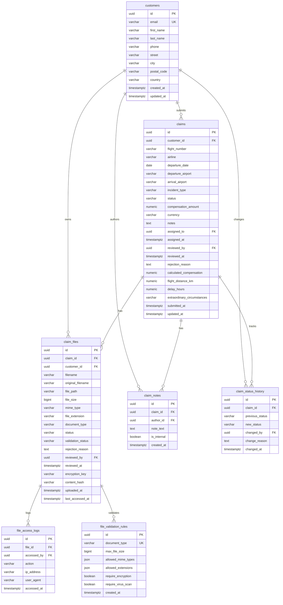

# Database Schema Documentation

**Last Updated**: 2025-10-30 (v0.2.0)
**Database**: PostgreSQL 15+
**ORM**: SQLAlchemy 2.0 (Async)

## Flight Claim System - Database Design

This document provides comprehensive documentation of the PostgreSQL database schema for the EasyAirClaim flight compensation claim management platform, including entity relationships, constraints, indexes, and data validation rules.

---

## Schema Overview

The database follows a normalized relational design with **7 core tables** organized into three functional domains:

1. **Customer Management**: Customer profiles and authentication
2. **Claim Processing**: Claims, notes, and status audit trail
3. **File Management**: Document storage, validation, and access logging

### Entity Relationship Diagram



---

## Table Specifications

### 1. Customers Table

**Table Name**: `customers`
**Purpose**: Stores customer profile information and serves as the primary entity for claim ownership

#### Column Definitions

| Column | Type | Constraints | Description |
|--------|------|-------------|-------------|
| `id` | `UUID` | `PRIMARY KEY`, `DEFAULT uuid_generate_v4()` | Unique customer identifier |
| `email` | `VARCHAR(255)` | `UNIQUE`, `NOT NULL`, `INDEX` | Customer email address (unique login) |
| `first_name` | `VARCHAR(50)` | `NOT NULL` | Customer's first name |
| `last_name` | `VARCHAR(50)` | `NOT NULL` | Customer's last name |
| `phone` | `VARCHAR(20)` | `NULLABLE` | Contact phone number (international format) |
| `street` | `VARCHAR(255)` | `NULLABLE` | Street address |
| `city` | `VARCHAR(100)` | `NULLABLE` | City name |
| `postal_code` | `VARCHAR(20)` | `NULLABLE` | Postal/ZIP code |
| `country` | `VARCHAR(100)` | `NULLABLE` | Country name |
| `created_at` | `TIMESTAMPTZ` | `NOT NULL`, `DEFAULT NOW()` | Record creation timestamp |
| `updated_at` | `TIMESTAMPTZ` | `NOT NULL`, `DEFAULT NOW()`, `ON UPDATE NOW()` | Last modification timestamp |

#### Indexes

```sql
CREATE INDEX ix_customers_email ON customers (email);
CREATE INDEX ix_customers_created_at ON customers (created_at);
```

#### Business Rules

- **Email Validation**: Must be a valid email format with '@' and domain
- **Name Requirements**: First and last names are mandatory
- **Address Fields**: All address components are optional (may be provided at claim submission)
- **Audit Trail**: Automatic timestamps for creation and updates

#### Relationships

- **One-to-Many**: One customer can have many claims
- **One-to-Many**: One customer can own many files
- **One-to-Many**: One customer can author many notes
- **One-to-Many**: One customer can be assigned many claims (as reviewer)

---

### 2. Claims Table

**Table Name**: `claims`
**Purpose**: Stores flight compensation claim information with detailed flight data, incident details, and admin workflow fields

#### Column Definitions

| Column | Type | Constraints | Description |
|--------|------|-------------|-------------|
| `id` | `UUID` | `PRIMARY KEY`, `DEFAULT uuid_generate_v4()` | Unique claim identifier |
| `customer_id` | `UUID` | `NOT NULL`, `FK → customers.id` | Owner of the claim |
| **Flight Information** ||||
| `flight_number` | `VARCHAR(10)` | `NOT NULL` | Flight number (e.g., "LH123") |
| `airline` | `VARCHAR(100)` | `NOT NULL` | Airline name |
| `departure_date` | `DATE` | `NOT NULL` | Scheduled departure date |
| `departure_airport` | `VARCHAR(3)` | `NOT NULL` | IATA airport code (e.g., "FRA") |
| `arrival_airport` | `VARCHAR(3)` | `NOT NULL` | IATA airport code (e.g., "JFK") |
| **Incident Details** ||||
| `incident_type` | `VARCHAR(50)` | `NOT NULL`, `CHECK` | Type: delay, cancellation, denied_boarding, baggage_delay |
| `status` | `VARCHAR(50)` | `NOT NULL`, `DEFAULT 'submitted'` | Claim status (see Status Enum below) |
| `notes` | `TEXT` | `NULLABLE` | Customer's additional notes |
| **Compensation** ||||
| `compensation_amount` | `NUMERIC(10,2)` | `NULLABLE` | Final approved compensation |
| `calculated_compensation` | `NUMERIC(10,2)` | `NULLABLE` | Auto-calculated EU261 compensation |
| `currency` | `VARCHAR(3)` | `NOT NULL`, `DEFAULT 'EUR'` | Currency code (ISO 4217) |
| **Admin Workflow (Phase 1)** ||||
| `assigned_to` | `UUID` | `NULLABLE`, `FK → customers.id` | Assigned reviewer user ID |
| `assigned_at` | `TIMESTAMPTZ` | `NULLABLE` | Assignment timestamp |
| `reviewed_by` | `UUID` | `NULLABLE`, `FK → customers.id` | Reviewer user ID |
| `reviewed_at` | `TIMESTAMPTZ` | `NULLABLE` | Review completion timestamp |
| `rejection_reason` | `TEXT` | `NULLABLE` | Reason for rejection (required if status=rejected) |
| **EU261 Calculation Fields (Phase 1)** ||||
| `flight_distance_km` | `NUMERIC(10,2)` | `NULLABLE` | Calculated flight distance |
| `delay_hours` | `NUMERIC(5,2)` | `NULLABLE` | Delay duration in hours |
| `extraordinary_circumstances` | `VARCHAR(255)` | `NULLABLE` | Description of extraordinary circumstances |
| **Timestamps** ||||
| `submitted_at` | `TIMESTAMPTZ` | `NOT NULL`, `DEFAULT NOW()` | Claim submission timestamp |
| `updated_at` | `TIMESTAMPTZ` | `NOT NULL`, `DEFAULT NOW()`, `ON UPDATE NOW()` | Last modification timestamp |

#### Status Enum Values

Valid claim statuses (enforced by application logic):

| Status | Description | Can Transition To |
|--------|-------------|------------------|
| `draft` | Claim being created | `submitted` |
| `submitted` | Submitted by customer | `under_review`, `rejected` |
| `under_review` | Being reviewed by admin | `approved`, `rejected` |
| `approved` | Compensation approved | `paid` |
| `rejected` | Claim rejected | `submitted` (resubmission) |
| `paid` | Compensation paid out | `closed` |
| `closed` | Claim finalized | - |

#### Incident Type Enum Values

| Type | Description | EU261 Coverage |
|------|-------------|---------------|
| `delay` | Flight delayed | ✅ Yes (3+ hours) |
| `cancellation` | Flight cancelled | ✅ Yes |
| `denied_boarding` | Denied boarding | ✅ Yes |
| `baggage_delay` | Baggage delayed/lost | ❌ No (Montreal Convention) |

#### Indexes

```sql
CREATE INDEX ix_claims_customer_id ON claims (customer_id);
CREATE INDEX ix_claims_status ON claims (status);
CREATE INDEX ix_claims_airline ON claims (airline);
CREATE INDEX ix_claims_submitted_at ON claims (submitted_at);
CREATE INDEX ix_claims_assigned_to ON claims (assigned_to);
CREATE INDEX ix_claims_incident_type ON claims (incident_type);
```

#### Business Rules

- **Status Transitions**: Validated by `ClaimWorkflowService` (see PHASE1_SUMMARY.md)
- **Rejection Reason**: Required when status changes to 'rejected'
- **EU261 Calculation**: Automatic compensation calculation based on distance and delay
- **Assignment**: Claims can be assigned to reviewers (users with admin role)
- **Audit Trail**: All status changes logged in `claim_status_history`

#### Relationships

- **Many-to-One**: Many claims belong to one customer
- **One-to-Many**: One claim has many files
- **One-to-Many**: One claim has many notes
- **One-to-Many**: One claim has many status history records

---

### 3. Claim Notes Table (Phase 1)

**Table Name**: `claim_notes`
**Purpose**: Stores internal and customer-facing notes on claims

#### Column Definitions

| Column | Type | Constraints | Description |
|--------|------|-------------|-------------|
| `id` | `UUID` | `PRIMARY KEY`, `DEFAULT uuid_generate_v4()` | Unique note identifier |
| `claim_id` | `UUID` | `NOT NULL`, `FK → claims.id` | Associated claim |
| `author_id` | `UUID` | `NOT NULL`, `FK → customers.id` | User who wrote the note |
| `note_text` | `TEXT` | `NOT NULL` | Note content |
| `is_internal` | `BOOLEAN` | `NOT NULL`, `DEFAULT true` | Internal (admin-only) vs customer-facing |
| `created_at` | `TIMESTAMPTZ` | `NOT NULL`, `DEFAULT NOW()` | Note creation timestamp |

#### Indexes

```sql
CREATE INDEX ix_claim_notes_claim_id ON claim_notes (claim_id);
CREATE INDEX ix_claim_notes_author_id ON claim_notes (author_id);
CREATE INDEX ix_claim_notes_is_internal ON claim_notes (is_internal);
```

#### Business Rules

- **Internal Notes**: Only visible to admins (is_internal=true)
- **Customer Notes**: Visible to customer and admins (is_internal=false)
- **Author Tracking**: All notes track who created them
- **Immutable**: Notes cannot be edited once created (audit trail)

---

### 4. Claim Status History Table (Phase 1)

**Table Name**: `claim_status_history`
**Purpose**: Complete audit trail of all claim status changes

#### Column Definitions

| Column | Type | Constraints | Description |
|--------|------|-------------|-------------|
| `id` | `UUID` | `PRIMARY KEY`, `DEFAULT uuid_generate_v4()` | Unique history record identifier |
| `claim_id` | `UUID` | `NOT NULL`, `FK → claims.id` | Associated claim |
| `previous_status` | `VARCHAR(50)` | `NULLABLE` | Status before change (null for first entry) |
| `new_status` | `VARCHAR(50)` | `NOT NULL` | New status after change |
| `changed_by` | `UUID` | `NOT NULL`, `FK → customers.id` | User who made the change |
| `change_reason` | `TEXT` | `NULLABLE` | Reason for status change (required for rejections) |
| `changed_at` | `TIMESTAMPTZ` | `NOT NULL`, `DEFAULT NOW()` | Timestamp of status change |

#### Indexes

```sql
CREATE INDEX ix_claim_status_history_claim_id ON claim_status_history (claim_id);
CREATE INDEX ix_claim_status_history_changed_by ON claim_status_history (changed_by);
CREATE INDEX ix_claim_status_history_changed_at ON claim_status_history (changed_at);
```

#### Business Rules

- **Automatic Creation**: New record created on every status change
- **Immutable**: History records are never updated or deleted
- **Change Reason**: Required for status transitions to 'rejected'
- **Audit Compliance**: Provides complete audit trail for regulatory compliance
- **Chronological Order**: Records ordered by changed_at timestamp

---

### 5. Claim Files Table

**Table Name**: `claim_files`
**Purpose**: Stores metadata for all uploaded documents (boarding passes, IDs, receipts, etc.)

#### Column Definitions

| Column | Type | Constraints | Description |
|--------|------|-------------|-------------|
| `id` | `UUID` | `PRIMARY KEY`, `DEFAULT uuid_generate_v4()` | Unique file identifier |
| `claim_id` | `UUID` | `NOT NULL`, `FK → claims.id` | Associated claim |
| `customer_id` | `UUID` | `NOT NULL`, `FK → customers.id` | File owner |
| **File Information** ||||
| `filename` | `VARCHAR(255)` | `NOT NULL` | Stored filename (encrypted) |
| `original_filename` | `VARCHAR(255)` | `NOT NULL` | Original filename from upload |
| `file_path` | `VARCHAR(500)` | `NOT NULL` | Path in Nextcloud storage |
| `file_size` | `BIGINT` | `NOT NULL` | File size in bytes |
| `mime_type` | `VARCHAR(100)` | `NOT NULL` | MIME type (detected via libmagic) |
| `file_extension` | `VARCHAR(10)` | `NOT NULL` | File extension |
| **Document Classification** ||||
| `document_type` | `VARCHAR(50)` | `NOT NULL` | Type: boarding_pass, id_document, receipt, etc. |
| `status` | `VARCHAR(50)` | `NOT NULL`, `DEFAULT 'pending'` | Status: pending, approved, rejected |
| `validation_status` | `VARCHAR(50)` | `NULLABLE` | Validation result |
| `rejection_reason` | `TEXT` | `NULLABLE` | Reason if rejected |
| **Review Tracking** ||||
| `reviewed_by` | `UUID` | `NULLABLE`, `FK → customers.id` | Admin who reviewed the file |
| `reviewed_at` | `TIMESTAMPTZ` | `NULLABLE` | Review timestamp |
| **Security** ||||
| `encryption_key` | `VARCHAR(255)` | `NOT NULL` | Fernet encryption key ID |
| `content_hash` | `VARCHAR(64)` | `NOT NULL` | SHA256 hash for integrity |
| **Timestamps** ||||
| `uploaded_at` | `TIMESTAMPTZ` | `NOT NULL`, `DEFAULT NOW()` | Upload timestamp |
| `last_accessed_at` | `TIMESTAMPTZ` | `NULLABLE` | Last download timestamp |

#### Document Type Enum Values

| Type | Description | Typical MIME Types |
|------|-------------|-------------------|
| `boarding_pass` | Boarding pass | PDF, PNG, JPG |
| `id_document` | Passport, ID card | PDF, PNG, JPG |
| `flight_ticket` | E-ticket | PDF |
| `receipt` | Expense receipt | PDF, PNG, JPG |
| `bank_statement` | Bank statement | PDF |
| `delay_certificate` | Airline delay certificate | PDF |
| `cancellation_notice` | Cancellation notice | PDF, PNG, JPG |
| `other` | Other supporting document | Various |

#### File Status Enum Values

| Status | Description |
|--------|-------------|
| `pending` | Awaiting review |
| `approved` | Document approved |
| `rejected` | Document rejected, re-upload required |

#### Indexes

```sql
CREATE INDEX ix_claim_files_claim_id ON claim_files (claim_id);
CREATE INDEX ix_claim_files_customer_id ON claim_files (customer_id);
CREATE INDEX ix_claim_files_document_type ON claim_files (document_type);
CREATE INDEX ix_claim_files_status ON claim_files (status);
CREATE INDEX ix_claim_files_content_hash ON claim_files (content_hash);
```

#### Business Rules

- **Encryption**: All files encrypted at rest using Fernet encryption
- **Virus Scanning**: Optional ClamAV integration for malware detection
- **File Size Limits**: Configurable max size (default: 50MB)
- **MIME Type Validation**: Validated against allowed types per document type
- **Integrity Verification**: SHA256 hash verified on download
- **Access Control**: Files accessible only by owner or admin

---

### 6. File Access Logs Table

**Table Name**: `file_access_logs`
**Purpose**: Audit trail for all file access operations

#### Column Definitions

| Column | Type | Constraints | Description |
|--------|------|-------------|-------------|
| `id` | `UUID` | `PRIMARY KEY`, `DEFAULT uuid_generate_v4()` | Unique log entry identifier |
| `file_id` | `UUID` | `NOT NULL`, `FK → claim_files.id` | File that was accessed |
| `accessed_by` | `UUID` | `NOT NULL`, `FK → customers.id` | User who accessed the file |
| `action` | `VARCHAR(50)` | `NOT NULL` | Action: upload, download, view, delete |
| `ip_address` | `VARCHAR(45)` | `NULLABLE` | IP address of accessor (IPv4 or IPv6) |
| `user_agent` | `VARCHAR(500)` | `NULLABLE` | Browser/client user agent |
| `accessed_at` | `TIMESTAMPTZ` | `NOT NULL`, `DEFAULT NOW()` | Access timestamp |

#### Indexes

```sql
CREATE INDEX ix_file_access_logs_file_id ON file_access_logs (file_id);
CREATE INDEX ix_file_access_logs_accessed_by ON file_access_logs (accessed_by);
CREATE INDEX ix_file_access_logs_accessed_at ON file_access_logs (accessed_at);
```

#### Business Rules

- **Immutable**: Log entries are never updated or deleted
- **Compliance**: Required for GDPR and data protection audits
- **Retention**: Logs retained per FILE_RETENTION_DAYS config
- **Privacy**: IP addresses may be anonymized per data protection rules

---

### 7. File Validation Rules Table

**Table Name**: `file_validation_rules`
**Purpose**: Configurable validation rules for different document types

#### Column Definitions

| Column | Type | Constraints | Description |
|--------|------|-------------|-------------|
| `id` | `UUID` | `PRIMARY KEY`, `DEFAULT uuid_generate_v4()` | Unique rule identifier |
| `document_type` | `VARCHAR(50)` | `NOT NULL`, `UNIQUE` | Document type (matches claim_files.document_type) |
| `max_file_size` | `BIGINT` | `NOT NULL` | Maximum file size in bytes |
| `allowed_mime_types` | `JSON` | `NOT NULL` | Array of allowed MIME types |
| `allowed_extensions` | `JSON` | `NOT NULL` | Array of allowed file extensions |
| `require_encryption` | `BOOLEAN` | `NOT NULL`, `DEFAULT true` | Whether encryption is required |
| `require_virus_scan` | `BOOLEAN` | `NOT NULL`, `DEFAULT true` | Whether virus scanning is required |
| `created_at` | `TIMESTAMPTZ` | `NOT NULL`, `DEFAULT NOW()` | Rule creation timestamp |

#### Example Rules

```json
// Boarding Pass
{
  "document_type": "boarding_pass",
  "max_file_size": 10485760,  // 10MB
  "allowed_mime_types": ["application/pdf", "image/png", "image/jpeg"],
  "allowed_extensions": [".pdf", ".png", ".jpg", ".jpeg"],
  "require_encryption": true,
  "require_virus_scan": true
}

// ID Document
{
  "document_type": "id_document",
  "max_file_size": 10485760,  // 10MB
  "allowed_mime_types": ["application/pdf", "image/png", "image/jpeg"],
  "allowed_extensions": [".pdf", ".png", ".jpg", ".jpeg"],
  "require_encryption": true,
  "require_virus_scan": true
}
```

#### Indexes

```sql
CREATE UNIQUE INDEX ix_file_validation_rules_document_type
    ON file_validation_rules (document_type);
```

#### Business Rules

- **Default Rules**: Created at application startup for all document types
- **Admin Configurable**: Rules can be updated via admin endpoints
- **Strict Validation**: Files that don't meet rules are rejected at upload
- **Backward Compatible**: Changing rules doesn't affect existing files

---

## Database Migrations

### Migration Tool

**Alembic** is used for database migrations (planned for production).

Current approach (MVP):
- Tables auto-created via SQLAlchemy `create_all()` in lifespan manager
- Production will use proper Alembic migrations

### Migration History

| Version | Date | Description |
|---------|------|-------------|
| Initial | 2025-10-15 | Created customers, claims tables |
| v0.1.0 | 2025-10-20 | Added file management tables (claim_files, file_access_logs, file_validation_rules) |
| v0.1.0 | 2025-10-29 | Added Phase 1 tables (claim_notes, claim_status_history) and admin workflow fields |
| v0.2.0 | 2025-10-30 | No schema changes (Phase 2 was backend only) |

---

## Performance Considerations

### Indexing Strategy

All foreign keys are indexed for fast joins:
- `customer_id` columns in all tables
- `claim_id` in claim_files, claim_notes, claim_status_history
- `file_id` in file_access_logs

Additional indexes on frequently queried fields:
- `email` in customers (unique index + search index)
- `status` in claims (filter index)
- `airline` in claims (filter index)
- `document_type` in claim_files (filter index)
- `content_hash` in claim_files (integrity check index)

### Query Optimization

**N+1 Query Prevention**:
- SQLAlchemy relationships use `lazy='selectin'` for optimal loading
- Admin endpoints use `.options(selectinload())` for eager loading

**Pagination**:
- All list endpoints use offset/limit pagination
- Maximum 1000 records per request

**Archival Strategy** (Future):
- Claims older than 7 years archived to separate table
- File access logs rotated after FILE_RETENTION_DAYS

---

## Security Considerations

### Data Protection

- **Encryption at Rest**: All file content encrypted with Fernet
- **PII Protection**: Customer data (email, phone, address) considered PII
- **GDPR Compliance**: File access logs track all data access
- **Data Retention**: Configurable retention periods for audit logs

### Access Control

- **Row-Level Security**: Customers can only access their own claims/files
- **Admin Override**: Admins can access all claims/files (logged in audit trail)
- **Role-Based Access**: Planned for Phase 3 (JWT with roles)

### Audit Trail

Complete audit trail maintained via:
- `created_at`/`updated_at` on all tables
- `claim_status_history` for status changes
- `file_access_logs` for file operations
- `claim_notes` for admin actions

---

## Schema Statistics (v0.2.0)

**Total Tables**: 7
**Total Columns**: ~90
**Total Indexes**: ~25
**Total Foreign Keys**: ~15
**Total Constraints**: ~30

**Relationships**:
- One-to-Many: 12 relationships
- Many-to-One: 15 relationships

**Enum Values**:
- Claim Status: 7 states
- Incident Type: 4 types
- Document Type: 8 types
- File Status: 3 states

---

## Next Schema Changes (Phase 3)

**Planned for Phase 3 - Authentication & Authorization**:

New Tables:
- `users` - Separate authentication from customer profile
- `refresh_tokens` - JWT refresh tokens
- `password_reset_tokens` - Password reset flow
- `login_attempts` - Security monitoring

Schema Updates:
- Add `user_id` FK to customers table
- Add `role` to users table (customer, reviewer, admin)
- Update foreign keys to reference users instead of customers for admin fields

---

## References

- SQLAlchemy Models: `app/models.py`
- Database Connection: `app/database.py`
- Migration Tool: Alembic (planned)
- PostgreSQL Version: 15+
- ORM Version: SQLAlchemy 2.0 (async)

**See Also**:
- [PHASE1_SUMMARY.md](../PHASE1_SUMMARY.md) - Admin workflow and Phase 1 tables
- [PHASE2_SUMMARY.md](../PHASE2_SUMMARY.md) - Email notifications (no schema changes)
- [file-management-system-design.md](file-management-system-design.md) - File management deep dive
