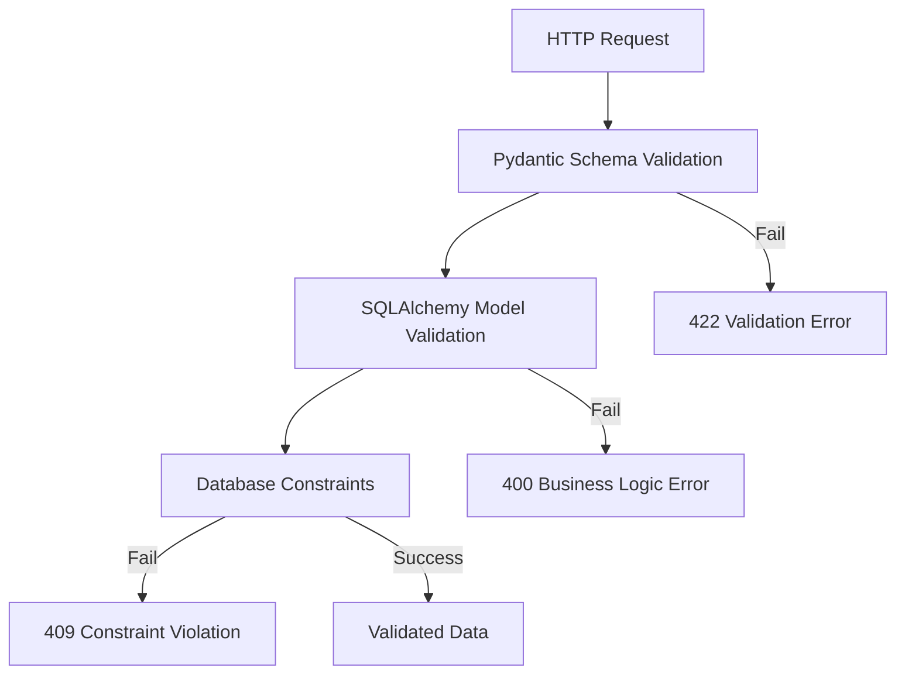

# Implementation Deep Dive

## Flight Claim System - Technical Implementation Analysis

This document provides an in-depth analysis of the key implementation patterns, design decisions, and technical solutions used in the Flight Claim System. It focuses on the repository pattern, PUT/PATCH endpoint implementation, validation logic, and database transaction handling.

## Repository Pattern Implementation

### Overview

The Flight Claim System implements the Repository Pattern to provide a clean abstraction layer between the business logic and data access concerns. This pattern enables better testability, maintainability, and separation of concerns.

### Base Repository Architecture

#### Generic Base Repository

The [`BaseRepository`](app/repositories/base.py:17) class provides common CRUD operations for all entities using Python generics:

```python
from typing import TypeVar, Generic, Type, Optional, List
from uuid import UUID
from sqlalchemy.ext.asyncio import AsyncSession

ModelType = TypeVar("ModelType", bound=Base)

class BaseRepository(Generic[ModelType]):
    """Base repository with common database operations."""
    
    def __init__(self, model: Type[ModelType], session: AsyncSession):
        self.model = model
        self.session = session
```

#### Key Design Principles

1. **Generic Type Safety**: Uses Python generics to ensure type safety across different models
2. **Session Injection**: Receives database session via constructor for proper lifecycle management
3. **Async Operations**: All database operations are asynchronous for better performance
4. **Transaction Management**: Proper handling of database transactions with commit/rollback

### Core CRUD Operations

#### Create Operation
```python
async def create(self, **kwargs) -> ModelType:
    """Create a new record."""
    instance = self.model(**kwargs)
    self.session.add(instance)
    await self.session.flush()           # Write to database but don't commit
    await self.session.refresh(instance) # Refresh instance with database-generated values
    await self.session.commit()          # Commit the transaction
    return instance
```

**Implementation Details**:
- Creates model instance with provided keyword arguments
- Uses `flush()` to write changes without committing transaction
- `refresh()` updates instance with database-generated values (ID, timestamps)
- `commit()` finalizes the transaction

#### Read Operations
```python
async def get_by_id(self, id: UUID) -> Optional[ModelType]:
    """Get a single record by ID."""
    result = await self.session.get(self.model, id)
    return result

async def get_all(self, skip: int = 0, limit: int = 100) -> List[ModelType]:
    """Get all records with pagination."""
    stmt = select(self.model).offset(skip).limit(limit)
    result = await self.session.execute(stmt)
    return result.scalars().all()
```

**Implementation Details**:
- `get_by_id()` uses SQLAlchemy's optimized `session.get()` method
- `get_all()` implements pagination with `offset()` and `limit()`
- Returns typed results based on the generic model type

#### Update Operation - The Key to PUT/PATCH Logic
```python
async def update(self, instance: ModelType, **kwargs) -> ModelType:
    """Update an existing record."""
    logger.info(f"Updating {self.model.__name__} with ID {instance.id}")
    logger.info(f"Update data: {kwargs}")
    
    for key, value in kwargs.items():
        if hasattr(instance, key):
            old_value = getattr(instance, key)
            setattr(instance, key, value)
            logger.info(f"Updated {key}: {old_value} -> {value}")
    
    self.session.add(instance)           # Mark instance as modified
    await self.session.flush()           # Write changes to database
    logger.info("Session flushed successfully")
    
    await self.session.refresh(instance) # Refresh with updated values
    logger.info("Instance refreshed successfully")
    
    await self.session.commit()          # Commit transaction
    logger.info("Transaction committed successfully")
    
    return instance
```

**Implementation Details**:
- Iterates through provided keyword arguments
- Only updates attributes that exist on the model (safety check)
- Comprehensive logging for debugging and monitoring
- Proper transaction handling with flush, refresh, and commit

### Specialized Repository Implementations

#### Customer Repository

The [`CustomerRepository`](app/repositories/customer_repository.py:12) extends the base repository with customer-specific operations:

```python
class CustomerRepository(BaseRepository[Customer]):
    """Repository for Customer model operations."""
    
    def __init__(self, session: AsyncSession):
        super().__init__(Customer, session)
    
    async def get_by_email(self, email: str) -> Optional[Customer]:
        """Get customer by email address."""
        return await self.get_by_field('email', email)
    
    async def search_by_name(self, name: str, skip: int = 0, limit: int = 100) -> List[Customer]:
        """Search customers by name (first name or last name)."""
        stmt = select(Customer).where(
            or_(
                Customer.first_name.ilike(f"%{name}%"),
                Customer.last_name.ilike(f"%{name}%")
            )
        ).offset(skip).limit(limit)
        
        result = await self.session.execute(stmt)
        return result.scalars().all()
```

**Business Logic Features**:
- Email-based lookups for unique identification
- Case-insensitive name searches using `ilike()`
- Complex queries with OR conditions for flexible searching

#### Critical Method: PUT vs PATCH Update Logic

```python
async def update_customer(self, customer_id: UUID, allow_null_values: bool = False, **kwargs) -> Optional[Customer]:
    """Update customer information.
    
    Args:
        customer_id: UUID of the customer to update
        allow_null_values: If True, None values will be set to null. If False, None values are filtered out.
        **kwargs: Fields to update
    """
    customer = await self.get_by_id(customer_id)
    if not customer:
        return None
    
    if allow_null_values:
        # For PUT operations: allow None values to be set to null
        update_data = kwargs
    else:
        # For PATCH operations: filter out None values to avoid overwriting with null
        update_data = {k: v for k, v in kwargs.items() if v is not None}
    
    if not update_data:
        return customer
    
    return await self.update(customer, **update_data)
```

**Key Implementation Insight**:
- The `allow_null_values` parameter is the **core differentiator** between PUT and PATCH
- **PUT Logic** (`allow_null_values=True`): All provided fields are updated, including None values
- **PATCH Logic** (`allow_null_values=False`): Only non-None fields are updated, preserving existing data

#### Claim Repository

The [`ClaimRepository`](app/repositories/claim_repository.py:13) provides claim-specific business operations:

```python
async def get_by_customer_id(self, customer_id: UUID, skip: int = 0, limit: int = 100) -> List[Claim]:
    """Get all claims for a specific customer."""
    return await self.get_all_by_field('customer_id', customer_id, skip, limit)

async def get_by_date_range(self, start_date: date, end_date: date, skip: int = 0, limit: int = 100) -> List[Claim]:
    """Get claims within a date range."""
    stmt = select(Claim).where(
        and_(
            Claim.departure_date >= start_date,
            Claim.departure_date <= end_date
        )
    ).offset(skip).limit(limit)
    
    result = await self.session.execute(stmt)
    return result.scalars().all()

async def get_claims_summary(self) -> dict:
    """Get summary statistics for claims."""
    total_claims = await self.count()
    
    stmt = select(Claim.status, func.count(Claim.id)).group_by(Claim.status)
    result = await self.session.execute(stmt)
    status_counts = dict(result.all())
    
    return {
        'total_claims': total_claims,
        'status_breakdown': status_counts
    }
```

**Advanced Features**:
- Date range queries with compound WHERE clauses
- Aggregation queries for business intelligence
- Statistical summaries using SQL functions

## PUT vs PATCH Implementation Analysis

### HTTP Semantic Differences

#### PUT Semantics (Complete Replacement)
- **RFC 7231**: "The PUT method requests that the state of the target resource be created or replaced with the state defined by the representation enclosed in the request message payload."
- **Implementation**: All fields must be provided; omitted fields become null
- **Idempotent**: Multiple identical requests have the same effect

#### PATCH Semantics (Partial Modification)
- **RFC 5789**: "The PATCH method requests that a set of changes described in the request entity be applied to the resource identified by the Request-URI."
- **Implementation**: Only provided fields are modified; omitted fields remain unchanged
- **Not necessarily idempotent**: Depends on the specific patch operations

### Router Implementation

#### PUT Endpoint Implementation

```python
@router.put("/{customer_id}", response_model=CustomerResponseSchema)
async def update_customer(
    customer_id: UUID,
    customer_data: CustomerUpdateSchema,  # All fields required
    db: AsyncSession = Depends(get_db)
) -> CustomerResponseSchema:
    """Update a customer completely (all fields required)."""
    repo = CustomerRepository(db)
    
    # Check if customer exists
    existing_customer = await repo.get_by_id(customer_id)
    if not existing_customer:
        raise HTTPException(
            status_code=status.HTTP_404_NOT_FOUND,
            detail=f"Customer with id {customer_id} not found"
        )
    
    # Email uniqueness validation
    if customer_data.email != existing_customer.email:
        email_customer = await repo.get_by_email(customer_data.email)
        if email_customer:
            raise HTTPException(
                status_code=status.HTTP_400_BAD_REQUEST,
                detail=f"Customer with email {customer_data.email} already exists"
            )
    
    # Update with all fields (allow null values for PUT)
    address_data = customer_data.address.dict() if customer_data.address else {}
    
    updated_customer = await repo.update_customer(
        customer_id=customer_id,
        allow_null_values=True,  # Key difference: allow setting fields to null
        email=customer_data.email,
        first_name=customer_data.first_name,
        last_name=customer_data.last_name,
        phone=customer_data.phone,
        **address_data
    )
    
    return CustomerResponseSchema.model_validate(updated_customer)
```

**PUT Implementation Details**:
1. **Schema Validation**: Uses `CustomerUpdateSchema` with all required fields
2. **Complete Replacement**: All fields are provided and updated
3. **Null Handling**: `allow_null_values=True` permits setting fields to null
4. **Business Rules**: Email uniqueness validation across customers

#### PATCH Endpoint Implementation

```python
@router.patch("/{customer_id}", response_model=CustomerResponseSchema)
async def patch_customer(
    customer_id: UUID,
    customer_data: CustomerPatchSchema,  # All fields optional
    db: AsyncSession = Depends(get_db)
) -> CustomerResponseSchema:
    """Partially update a customer (only specified fields are updated)."""
    logger.info(f"PATCH request received for customer {customer_id}")
    logger.info(f"Request data: {customer_data.model_dump()}")
    
    repo = CustomerRepository(db)
    
    # Check if customer exists
    existing_customer = await repo.get_by_id(customer_id)
    if not existing_customer:
        logger.warning(f"Customer {customer_id} not found")
        raise HTTPException(
            status_code=status.HTTP_404_NOT_FOUND,
            detail=f"Customer with id {customer_id} not found"
        )
    
    # Build update data, filtering out None values and empty strings
    update_data = {}
    
    # Email handling with empty string conversion
    if (customer_data.email is not None and
        customer_data.email.strip()):  # Not empty or whitespace
        update_data['email'] = customer_data.email.strip()
    
    # Other fields with None filtering
    if customer_data.first_name is not None:
        update_data['first_name'] = customer_data.first_name.strip() if customer_data.first_name else customer_data.first_name
    if customer_data.last_name is not None:
        update_data['last_name'] = customer_data.last_name.strip() if customer_data.last_name else customer_data.last_name
    
    # Address handling
    if customer_data.address is not None:
        address_data = customer_data.address.dict()
        update_data.update({
            'street': address_data.get('street'),
            'city': address_data.get('city'),
            'postal_code': address_data.get('postal_code'),
            'country': address_data.get('country')
        })
    
    logger.info(f"Update data after filtering: {update_data}")
    
    # If no fields to update, return existing customer
    if not update_data:
        logger.info("No fields to update, returning existing customer")
        return CustomerResponseSchema.model_validate(existing_customer)
    
    # Update customer with filtered data
    updated_customer = await repo.update_customer(
        customer_id=customer_id, 
        allow_null_values=False,  # Key difference: preserve existing values
        **update_data
    )
    
    return CustomerResponseSchema.model_validate(updated_customer)
```

**PATCH Implementation Details**:
1. **Schema Validation**: Uses `CustomerPatchSchema` with all optional fields
2. **Selective Updates**: Only non-null fields are included in update
3. **Data Filtering**: Complex logic to handle empty strings and null values
4. **Preservation**: `allow_null_values=False` preserves existing field values
5. **Edge Case Handling**: Comprehensive logging and empty update detection

### Schema Design for PUT/PATCH

#### PUT Schema (Complete Update)
```python
class CustomerUpdateSchema(BaseModel):
    """Schema for updating a customer (PUT - all fields required)."""
    
    email: EmailStr                    # Required
    first_name: str = Field(..., max_length=50, alias="firstName")  # Required
    last_name: str = Field(..., max_length=50, alias="lastName")   # Required
    phone: Optional[str] = Field(None, max_length=20)              # Optional but explicit
    address: Optional[AddressSchema] = None                        # Optional but explicit
    
    class Config:
        populate_by_name = True
```

#### PATCH Schema (Partial Update)
```python
class CustomerPatchSchema(BaseModel):
    """Schema for partially updating a customer (PATCH - only specified fields updated)."""
    
    email: Union[None, str] = None     # Optional - special handling for empty strings
    first_name: Optional[str] = Field(None, max_length=50, alias="firstName")  # Optional
    last_name: Optional[str] = Field(None, max_length=50, alias="lastName")   # Optional
    phone: Optional[str] = Field(None, max_length=20)                         # Optional
    address: Optional[AddressSchema] = None                                   # Optional
    
    @validator('email', pre=True)
    def handle_empty_email(cls, v):
        """Convert empty strings to None to avoid validation errors."""
        if v == "" or (isinstance(v, str) and v.strip() == ""):
            return None
        return v
    
    @validator('email')
    def validate_email_if_provided(cls, v):
        """Validate email format only if a non-empty string is provided."""
        if v is not None:
            if '@' not in v or '.' not in v.split('@')[-1]:
                raise ValueError("Invalid email format")
        return v
    
    class Config:
        populate_by_name = True
```

**Key Schema Differences**:
1. **Field Requirements**: PUT requires all fields, PATCH makes all fields optional
2. **Email Validation**: PATCH has special handling for empty strings
3. **Type Annotations**: PATCH uses `Union[None, str]` for flexible email handling
4. **Validators**: PATCH includes custom validators for edge case handling

## Validation Architecture

### Multi-Layer Validation Strategy

The system implements validation at multiple layers for comprehensive data integrity:



#### Layer 1: Pydantic Schema Validation

```python
class CustomerCreateSchema(BaseModel):
    email: EmailStr  # Automatic email format validation
    first_name: str = Field(..., max_length=50, alias="firstName")
    last_name: str = Field(..., max_length=50, alias="lastName")
    phone: Optional[str] = Field(None, max_length=20)
    
    @validator('email', pre=True)
    def handle_empty_email(cls, v):
        if v == "" or (isinstance(v, str) and v.strip() == ""):
            return None
        return v
```

**Features**:
- Type checking and conversion
- Field length validation
- Email format validation using `EmailStr`
- Custom validators for business rules
- Field aliasing (camelCase ↔ snake_case)

#### Layer 2: SQLAlchemy Model Validation

```python
class Customer(Base):
    @validates('email')
    def validate_email(self, key, address):
        """Validate email format."""
        if address:
            if '@' not in address or '.' not in address.split('@')[-1]:
                raise ValueError("Invalid email format")
        return address
    
    @hybrid_property
    def full_name(self):
        """Return full name."""
        return f"{self.first_name} {self.last_name}"
```

**Features**:
- Model-level business rule validation
- Cross-field validation capabilities
- Database-level data type enforcement
- Hybrid properties for computed fields

#### Layer 3: Database Constraints

```sql
CREATE TABLE customers (
    id UUID PRIMARY KEY DEFAULT uuid_generate_v4(),
    email VARCHAR(255) NOT NULL UNIQUE,
    first_name VARCHAR(50) NOT NULL,
    last_name VARCHAR(50) NOT NULL,
    -- ... other fields
    
    CONSTRAINT uq_customers_email UNIQUE (email)
);
```

**Features**:
- Primary key constraints
- Unique constraints (email uniqueness)
- Foreign key referential integrity
- Check constraints for enums
- Not-null constraints

## Database Transaction Management

### Async Transaction Patterns

The system uses SQLAlchemy's async transaction capabilities with proper resource management:

#### Session Lifecycle Management

```python
async def get_db() -> AsyncGenerator[AsyncSession, None]:
    """Dependency to get database session."""
    async with AsyncSessionLocal() as session:
        try:
            yield session
        finally:
            await session.close()
```

**Implementation Details**:
- Uses async context manager for automatic cleanup
- Session is created per request and closed after response
- Proper exception handling ensures cleanup even on errors

#### Transaction Execution Pattern

```python
async def update(self, instance: ModelType, **kwargs) -> ModelType:
    """Update an existing record with proper transaction handling."""
    # 1. Modify the instance
    for key, value in kwargs.items():
        if hasattr(instance, key):
            setattr(instance, key, value)
    
    # 2. Add to session (mark as dirty)
    self.session.add(instance)
    
    # 3. Flush changes to database (but don't commit yet)
    await self.session.flush()
    
    # 4. Refresh instance with database-generated values
    await self.session.refresh(instance)
    
    # 5. Commit the transaction
    await self.session.commit()
    
    return instance
```

**Transaction Steps Explained**:
1. **Modify Instance**: Update Python object in memory
2. **Add to Session**: Mark instance as modified in SQLAlchemy session
3. **Flush**: Send SQL to database but keep transaction open
4. **Refresh**: Retrieve updated values (timestamps, computed fields)
5. **Commit**: Finalize the transaction

### Error Handling and Rollback

```python
async def complex_business_operation(self, data):
    """Example of complex operation with proper error handling."""
    async with self.session.begin():
        try:
            # Multiple database operations
            customer = await self.create_customer(**data['customer'])
            claim = await self.create_claim(customer.id, **data['claim'])
            
            # Business logic validation
            if not self.validate_business_rules(customer, claim):
                raise BusinessLogicError("Validation failed")
            
            return claim
        except Exception as e:
            # Automatic rollback due to context manager
            logger.error(f"Operation failed: {e}")
            raise
```

**Error Handling Features**:
- Automatic rollback on exceptions
- Proper logging for debugging
- Context managers for resource cleanup
- Exception propagation for proper HTTP error responses

## Performance Optimization Strategies

### Connection Pooling

```python
# Database configuration with connection pooling
engine = create_async_engine(
    DATABASE_URL,
    echo=True,              # SQL logging for development
    future=True,            # Use SQLAlchemy 2.0 API
    pool_size=20,           # Number of permanent connections
    max_overflow=30,        # Additional connections when needed
    pool_timeout=30,        # Timeout for getting connection
    pool_recycle=3600      # Recycle connections every hour
)
```

### Query Optimization

#### Efficient Relationship Loading
```python
async def get_customer_with_claims(self, customer_id: UUID) -> Optional[Customer]:
    """Get customer with their claims in single query."""
    stmt = select(Customer).options(
        selectinload(Customer.claims)  # Eager load claims
    ).where(Customer.id == customer_id)
    
    result = await self.session.execute(stmt)
    return result.scalar_one_or_none()
```

#### Index-Optimized Queries
```python
async def search_by_email(self, email: str, skip: int = 0, limit: int = 100) -> List[Customer]:
    """Search using indexed email field."""
    stmt = select(Customer).where(
        Customer.email.ilike(f"%{email}%")  # Uses email index
    ).offset(skip).limit(limit)
    
    result = await self.session.execute(stmt)
    return result.scalars().all()
```

### Memory Management

#### Efficient Pagination
```python
async def get_large_dataset(self, skip: int = 0, limit: int = 100):
    """Paginated queries to avoid loading large datasets."""
    # Limit enforced to prevent memory issues
    limit = min(limit, 1000)  # Maximum 1000 records per request
    
    stmt = select(Customer).offset(skip).limit(limit)
    result = await self.session.execute(stmt)
    return result.scalars().all()
```

## Testing Strategy for Implementation

### Repository Testing

```python
@pytest.mark.asyncio
async def test_put_vs_patch_behavior():
    """Test that PUT and PATCH behave differently for null values."""
    # Setup
    customer = await repo.create_customer(
        email="test@example.com",
        first_name="John",
        last_name="Doe",
        phone="+1234567890"
    )
    
    # Test PUT behavior (allows null values)
    updated_put = await repo.update_customer(
        customer.id,
        allow_null_values=True,  # PUT semantics
        phone=None  # Should set phone to null
    )
    assert updated_put.phone is None
    
    # Reset phone
    await repo.update_customer(customer.id, allow_null_values=True, phone="+9876543210")
    
    # Test PATCH behavior (preserves existing values)
    updated_patch = await repo.update_customer(
        customer.id,
        allow_null_values=False,  # PATCH semantics
        first_name="Updated"  # Only update first_name
    )
    assert updated_patch.first_name == "Updated"
    assert updated_patch.phone == "+9876543210"  # Phone preserved
```

## Security Considerations

### Input Validation and Sanitization

```python
@validator('email', pre=True)
def sanitize_email(cls, v):
    """Sanitize email input."""
    if isinstance(v, str):
        v = v.strip().lower()  # Normalize email
        if len(v) > 255:       # Prevent buffer overflow
            raise ValueError("Email too long")
    return v
```

### SQL Injection Prevention

```python
# Safe: Using SQLAlchemy ORM (parameterized queries)
stmt = select(Customer).where(Customer.email == email_param)

# Safe: Using text() with bound parameters
stmt = text("SELECT * FROM customers WHERE email = :email")
result = await session.execute(stmt, {"email": email_param})
```

### Data Privacy

```python
def to_dict(self, include_sensitive=False):
    """Convert model to dict with optional sensitive data exclusion."""
    data = {
        'id': str(self.id),
        'email': self.email if include_sensitive else self.masked_email,
        'first_name': self.first_name,
        'last_name': self.last_name,
        'created_at': self.created_at.isoformat()
    }
    return data
```

This implementation deep dive demonstrates how the Flight Claim System uses sophisticated patterns and careful attention to HTTP semantics to provide a robust, maintainable, and performant API.