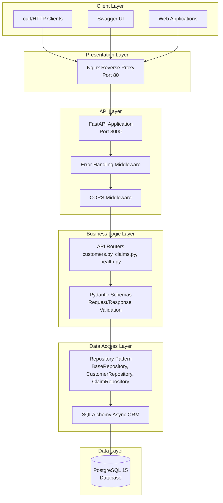
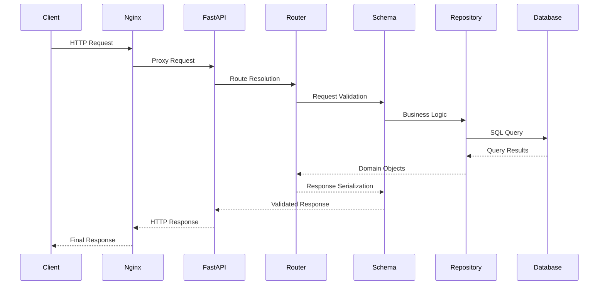
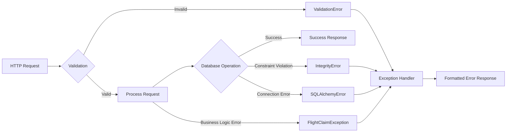
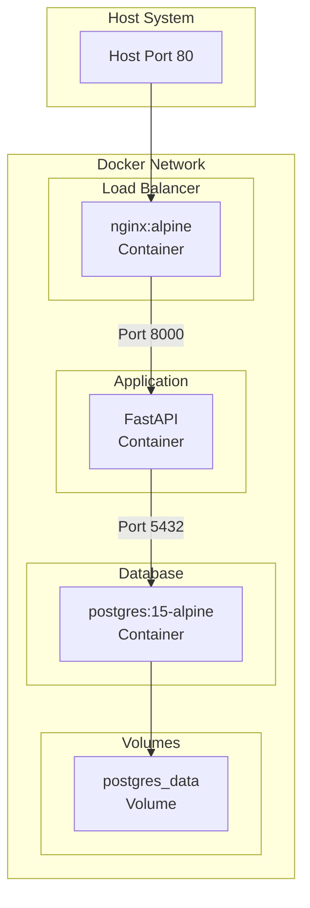

# System Architecture Overview

## Flight Claim API - Technical Architecture

The Flight Claim System is a modern, scalable Python/FastAPI application designed using clean architecture principles and industry best practices. This document provides a comprehensive overview of the system's architecture, design patterns, and component relationships.

## Architecture Summary



## Core Design Principles

### 1. **Layered Architecture**
The system follows a clean layered architecture with clear separation of concerns:

- **Presentation Layer**: Nginx reverse proxy handling external requests
- **API Layer**: FastAPI application with middleware for cross-cutting concerns
- **Business Logic**: Routers handling HTTP endpoints and Pydantic validation
- **Data Access**: Repository pattern abstracting database operations
- **Data Layer**: PostgreSQL database with proper schema design

### 2. **Repository Pattern**
Implements the repository pattern for data access abstraction:

```python
# Base repository with common CRUD operations
class BaseRepository(Generic[ModelType]):
    def __init__(self, model: Type[ModelType], session: AsyncSession)
    async def get_by_id(self, id: UUID) -> Optional[ModelType]
    async def get_all(self, skip: int = 0, limit: int = 100) -> List[ModelType]
    async def create(self, **kwargs) -> ModelType
    async def update(self, instance: ModelType, **kwargs) -> ModelType
```

### 3. **Dependency Injection**
Uses FastAPI's dependency injection for database sessions and repository instances:

```python
async def get_db() -> AsyncGenerator[AsyncSession, None]:
    async with AsyncSessionLocal() as session:
        yield session

@router.post("/customers")
async def create_customer(
    customer_data: CustomerCreateSchema,
    db: AsyncSession = Depends(get_db)  # Injected dependency
):
```

## Component Architecture

### FastAPI Application (`app/main.py`)
- **Lifespan Management**: Database initialization on startup
- **Middleware Setup**: Error handling and CORS configuration  
- **Router Registration**: API endpoint organization
- **Auto-Documentation**: Swagger UI and ReDoc integration

```python
app = FastAPI(
    title="Flight Claim System API",
    description="API for managing flight compensation claims",
    version=__version__,
    docs_url="/docs",
    redoc_url="/redoc",
    lifespan=lifespan  # Async context manager
)
```

### Database Layer (`app/database.py`)
- **Async Engine**: SQLAlchemy 2.0 with asyncpg driver
- **Session Management**: Async session factory with proper cleanup
- **Connection Pooling**: Automatic connection pool management
- **Schema Initialization**: Automated table creation

### Data Models (`app/models.py`)
- **Customer Model**: User profile with embedded address
- **Claim Model**: Flight compensation claims with status workflow
- **Relationships**: Proper foreign key constraints and ORM relationships
- **Validation**: Model-level validators for data integrity

### API Schemas (`app/schemas.py`)
- **Request Validation**: Pydantic schemas for input validation
- **Response Serialization**: Consistent API response formats
- **PUT vs PATCH**: Different schemas for complete vs partial updates
- **Field Aliases**: Camel case API with snake_case database mapping

### Repository Layer (`app/repositories/`)
- **Base Repository**: Generic CRUD operations for all entities
- **Specialized Repositories**: Customer and Claim specific business logic
- **Transaction Management**: Proper async transaction handling
- **Query Optimization**: Efficient database queries with relationships

### API Routers (`app/routers/`)
- **Customers Router**: User management endpoints
- **Claims Router**: Claim submission and tracking
- **Health Router**: System monitoring and health checks
- **Error Handling**: Comprehensive error responses

### Error Handling (`app/middleware.py`, `app/exceptions.py`)
- **Custom Exceptions**: Domain-specific error types
- **Global Exception Handling**: Consistent error response format
- **Validation Errors**: Detailed validation failure messages
- **Database Errors**: Proper handling of constraint violations

## Data Flow Architecture

### Request Processing Flow



### Error Handling Flow



## Technology Stack

### Core Framework
- **FastAPI 0.104.1**: Modern, fast web framework with automatic API documentation
- **Uvicorn**: ASGI server with high performance async support
- **Python 3.11+**: Latest Python with enhanced async capabilities

### Database Stack
- **PostgreSQL 15**: Robust relational database with JSON support
- **SQLAlchemy 2.0**: Modern async ORM with declarative models
- **Asyncpg**: High-performance async PostgreSQL driver
- **Alembic**: Database migration management

### Validation & Serialization
- **Pydantic 2.5**: Fast data validation with type hints
- **Email Validator**: Robust email format validation

### Infrastructure
- **Docker & Docker Compose**: Containerized deployment
- **Nginx**: Reverse proxy and load balancer
- **Python-dotenv**: Environment configuration management

## Deployment Architecture

### Multi-Container Setup



### Service Dependencies
- **nginx**: Depends on api service availability
- **api**: Depends on database health check passing
- **db**: Independent service with persistent volume

## Security Architecture

### Request Security
- **CORS Configuration**: Configurable cross-origin request handling
- **Input Validation**: Multi-layer validation (Pydantic + SQLAlchemy)
- **SQL Injection Prevention**: Parameterized queries via SQLAlchemy ORM

### Database Security
- **Connection Pooling**: Managed database connections
- **Environment Variables**: Secure credential management
- **Foreign Key Constraints**: Data integrity enforcement

### Error Handling Security
- **Information Disclosure**: Sanitized error messages in production
- **Exception Logging**: Detailed logging for debugging without exposure
- **Status Code Consistency**: Proper HTTP status codes

## Performance Architecture

### Async Processing
- **Async/Await**: Non-blocking I/O operations throughout the stack
- **Connection Pooling**: Efficient database connection reuse
- **Dependency Injection**: Optimized resource management

### Database Optimization
- **Indexed Columns**: Primary keys, foreign keys, and email uniqueness
- **Relationship Loading**: Efficient ORM relationship queries
- **Transaction Management**: Proper commit/rollback handling

### Caching Strategy
- **Connection Pooling**: Database connection reuse
- **Session Management**: Efficient request-scoped sessions
- **Static Content**: Nginx serving static assets

## Monitoring & Health Checks

### Health Check Endpoints
- **`/health`**: Basic API health status
- **`/health/db`**: Detailed database connectivity
- **`/health/detailed`**: Comprehensive system information

### Observability
- **Structured Logging**: Comprehensive request/response logging
- **Error Tracking**: Detailed exception information
- **Performance Metrics**: Database query performance monitoring

## Scalability Architecture

### Horizontal Scaling
- **Stateless Design**: No server-side session state
- **Database Connection Pooling**: Efficient connection management
- **Load Balancer Ready**: Nginx configuration supports multiple backends

### Vertical Scaling
- **Async Operations**: Efficient CPU and memory usage
- **Connection Pooling**: Database resource optimization
- **Configurable Limits**: Pagination and rate limiting support

## API Design Philosophy

### RESTful Design
- **Resource-based URLs**: Clear resource identification
- **HTTP Methods**: Proper verb usage (GET, POST, PUT, PATCH)
- **Status Codes**: Meaningful HTTP response codes
- **Content Negotiation**: JSON request/response format

### Consistency
- **Naming Conventions**: camelCase API with snake_case database
- **Error Format**: Standardized error response structure
- **Pagination**: Consistent skip/limit parameters
- **Timestamps**: UTC timestamps with ISO 8601 format

This architecture provides a solid foundation for a production-ready flight claim management system with excellent maintainability, scalability, and developer experience.